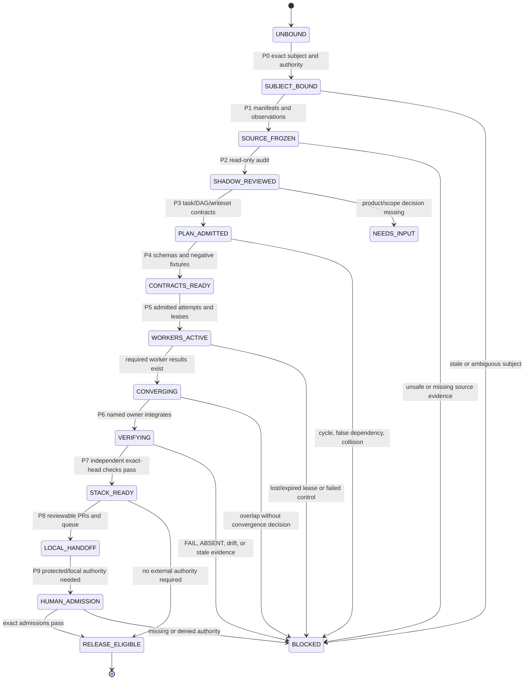
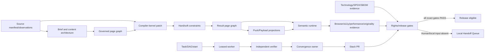

# Repository Agent Contract

## Mission

Build and verify an evidence-first website design compiler that converts briefs and observed sources into original, accessible, performant, commercially governable website artifacts.

This repository is the product-specific code and routing center. Shared procedures remain in `ed3c/skills-shared` and are consumed only through exact public-safe bindings. Never vendor, reconstruct, quote in bulk, or publish private shared-skill bodies.

## Required read order

Before analysis or writes, read:

1. [`README.md`](README.md)
2. [`docs/architecture/SHADOW_ARCHITECT_MONITOR.md`](docs/architecture/SHADOW_ARCHITECT_MONITOR.md)
3. [`docs/architecture/STACKED_PR_INDEX.md`](docs/architecture/STACKED_PR_INDEX.md)
4. [`docs/architecture/LOCAL_HANDOFF_EXECUTION_QUEUE.md`](docs/architecture/LOCAL_HANDOFF_EXECUTION_QUEUE.md)
5. the owning issue, PR, schema, implementation, test, and exact workflow artifact

A stale chat summary is not canonical state.

## Current integration boundary

Reviewed implementation convergence before the documentation refresh:

```yaml
repository: ed3c/website-design-compiler
canonical_main_sha: 4a79d9635911690950f02edda4505672ba7544f6
root_delivery_pr: 44
root_delivery_branch: codex/pr42-delivery-v2
root_delivery_head: 9e67222dea5580b1f807266162909422771da99e
integration_pr: 54
integration_branch: agent/shadow-architect-control-plane
integrated_code_head: c58958ee30e76d8aa9ad9388e6bf10adbd5a7db5
```

Integrated carriers:

- #148 — source plane, compiler kernel, production content patch, edited-page browser proof;
- #136 — exact technology identity, SPDX expressions, SBOM/notices, engineering convergence;
- #138 — task/DAG/start, replay-safe lease, verifier handoff, queue compiler;
- #129 — credential-free Markdown/CSV/JSON projection;
- #130 — optional-capability decision packet contract only.

PR #54 is not `main`. PR #44 is not released. Issue #25 and Human-controlled visual, Storybook, rights, provider, and release gates remain fail-closed.

## Truth vocabulary

Do not conflate these terms:

- **IMPLEMENTED** — code or a contract exists.
- **VERIFIED** — exact-subject commands and negative controls passed.
- **INTEGRATED** — verified commits are reachable from the current integration branch.
- **ADMITTED** — the required engineering, Human, legal, provider, source-publication, credential, or physical authority accepted the exact subject.
- **RELEASED** — the exact subject passed the release profile and was promoted by an authorized owner.

Repository evidence states are:

`PASS | FAIL | ABSENT | NOT_IMPLEMENTED | NOT_EXERCISED | SKIPPED_BY_POLICY | NEEDS_INPUT | BLOCKED`.

Rules:

- docs, plans, prompts, schemas, branches, PRs, fixtures, and generated receipt shells do not prove runtime behavior;
- `PASS` requires exact-subject execution and independently checkable artifacts;
- missing required evidence is `ABSENT` or `BLOCKED`;
- available code not run against the real protected/local/provider subject is `NOT_EXERCISED`;
- absent code is `NOT_IMPLEMENTED`;
- missing or contradictory product/source input is `NEEDS_INPUT`;
- an optional capability excluded by policy is `SKIPPED_BY_POLICY`, not fake `PASS`.

## Required control-plane bindings

The canonical binding is `.agents/bindings/repository-control-plane.json`. Required methods include:

- `shared-skills-infra`
- `procedural-shadow-runtime`
- `agentic-tech-lead-orchestration`
- `spatial-loop-systems-engineering`
- `git-town-stacked-pr-worker`
- `dual-forge-repository-loop` only when a local Forgejo plane is explicitly configured

A missing, stale, or mismatched binding is `ABSENT`. Do not fall back to remembered private prompt text.

## Exact-subject envelope

Before analysis or side effects, bind every applicable field:

```yaml
repository: ed3c/website-design-compiler
canonical_main_sha: <sha>
base_ref: <ref>
base_sha: <sha>
head_ref: <ref-or-ABSENT>
head_sha: <sha-or-ABSENT>
issue: <number-and-url>
pull_request: <number-and-url-or-ABSENT>
program_id: <id>
phase_id: <P0-P9>
task_id: <id>
attempt_id: <id>
lease_id: <id-or-NOT_APPLICABLE>
source_manifest_digest: <sha256-or-ABSENT>
task_contract_digest: <sha256-or-ABSENT>
control_plane_binding_digest: <sha256>
```

A changed Git SHA, source byte identity, parser/configuration, extraction/publication policy, package/model/provider revision, task contract, writeset, command set, screenshot bytes, or release profile is a new subject. Previous receipts do not transfer automatically.

## Source intake boundary

Article, PDF, URL, repository, package, model, provider, font, asset, service, and user-provided inputs enter through source manifests.

Required distinctions:

- source bytes or exact Git identity;
- parser/observer identity and configuration;
- access classification;
- publication classification;
- exact anchors and observation digests;
- observations versus inferences;
- warnings and unsupported states.

Never commit private or user-provided source bytes merely because an Agent can read them. Publication requires explicit source-owner authority.

Current source-plane truth:

- supplied article/Markdown adapter: VERIFIED and INTEGRATED;
- exact repository snapshot adapter: VERIFIED and INTEGRATED;
- PDF digest-only boundary: VERIFIED and INTEGRATED, real parser `NOT_EXERCISED`;
- general URL acquisition adapter: `NOT_IMPLEMENTED`, issue #72.

## Shadow Architect Monitor

The Shadow monitor is read-only. It is a review checkpoint, not a background process.

Run it:

1. after exact-subject freeze;
2. after source normalization;
3. before worker admission;
4. after every convergence point;
5. before PR publication;
6. before issue closure;
7. before any merge or release proposal.

It checks:

- stale/ambiguous refs and synthetic merge-ref misuse;
- source claims without anchors;
- problem → invariant → contract → implementation → runtime → release/handoff closure;
- documentation-only evidence promotion;
- missing negative controls;
- hidden product-scope expansion;
- false DAG edges or overlapping writesets without one convergence owner;
- private skill/source/credential leakage;
- software/model/output/service/data/asset rights conflation;
- cloud evidence mislabeled as local/physical/provider proof;
- failure, cleanup, cancellation, retry, timeout, revocation, and fallback paths.

The monitor never edits code, supplies credentials, makes legal/product decisions, resolves conflicts, merges, closes Human-bound issues, or promotes production.

## Tech Lead controller

The Tech Lead owns:

- exact problem and invariant extraction;
- global objective retention;
- source/unknown inventory;
- task contracts and stop conditions;
- dependency DAG and separate start-eligibility graph;
- writeset/resource leases;
- worker and attempt identities;
- independent verification assignment;
- convergence ownership;
- molecular Stack PR topology;
- issue/PR closure decisions;
- Local Handoff Execution Queue compilation.

Do not use one mega-prompt or one mega-branch for a multi-plane program.

## Global phase state machine



## Directory ownership and local state machines

| Directory/module | Owner | Local states | Input → output |
|---|---|---|---|
| `src/source-plane/` | source steward | `UNBOUND → MANIFESTED → OBSERVED`; PDF may stop at `NOT_EXERCISED` | bytes/Git/PDF request → manifest/observation/inference |
| `src/compiler-kernel/` | compiler-kernel owner | `PROPOSED → CONFLICT/REJECTED/APPLIED → REVERTED`; solver `NOT_REQUIRED/REQUIRED_NOT_ADMITTED` | page graph + source-bound patch → candidate/report/receipt/result graph |
| `src/technology-admission.ts`, `src/spdx-policy.ts`, `src/sbom-notice.ts`, `src/technology-convergence.ts` | technology-governance owner | `CANDIDATE → ALLOW/REVIEW_REQUIRED/DENY/UNKNOWN → REVOKED` | exact candidate + rights/SBOM evidence → engineering admission receipt |
| `src/control-plane/` | Tech Lead control-plane owner | task `QUEUED/BLOCKED/READY/RUNNING/REVIEW_REQUIRED/COMPLETE`; lease `ACTIVE/CHECKPOINTED/RELEASED/LOST/EXPIRED` | program/task/predecessor evidence → start, lease, verifier, handoff, queue records |
| `src/projections/` | projection owner | `CURRENT/DRIFTED/UNKNOWN` | canonical records → local Markdown/CSV/JSON bundle |
| `src/optional-capability-decisions.ts` | product architecture owner | `ADOPT/DEFER/REJECT/SEPARATE_PRODUCT`, always `implementationEligible:false` inside packet | evidence + Human product decision → decision packet/new DAG eligibility |
| `apps/site/` | runtime/authoring owner | compiled → authored/persisted → rendered | governed page graph/Puck/Payload → semantic runtime |
| `scripts/` | evidence producer owner | input-bound → executed → receipt written | exact artifacts/config → receipts and durable evidence |
| `schemas/` | contract owner | draft → validated → versioned | artifact shape → strict machine validation |
| `tests/` | independent verifier | positive/negative → PASS/FAIL | implementation + fixtures → exact verification evidence |
| `docs/architecture/` | architecture/doc convergence owner | proposed → reviewed → current/superseded | code/issue/PR truth → routing, monitor, stack, queue docs |

Only the named owner edits a shared convergence file.

## End-to-end DAG



## Task packet contract

Every worker receives:

```yaml
task_id: <id>
role: <worker-role>
program_issue: <number>
owning_issue: <number>
subject: <exact identities>
goal: <one behavior>
invariants: []
prerequisites: {receipts: [], states: []}
allowed_writeset: []
excluded_paths: []
allowed_commands: []
forbidden_side_effects: []
positive_fixtures: []
negative_controls: []
expected_artifacts: []
verification_owner: <different-role>
convergence_owner: <role-or-NOT_APPLICABLE>
time_budget: <bounded>
stop_conditions: []
handoff_schema: <version>
```

Unresolved placeholders, absent prerequisites, unknown writeset, no verifier, or no stop condition means `BLOCKED`.

## Parallel workers and leases

Parallel work is allowed only when prerequisites pass and writesets are disjoint or one explicit convergence owner controls overlap.

Keep these records separate:

`plan → attempt → lease → checkpoint → worker result → verifier receipt → convergence decision → terminal state`.

A plan is not a lease. A branch is not a running attempt. A worker result is not verification. A PR merge ref is not canonical main evidence.

Lost, expired, revoked, or colliding leases cannot write. Retries use new attempt/lease IDs. Active private carrier state stays local.

## Compiler-kernel rules

- The canonical page graph owns semantic identity; Puck, Payload, canvas, and future collaboration systems are projections.
- Forward publishable edits require source-observation provenance admitted by the patch evidence set.
- Production content edits update the section props and embedded content contract atomically.
- Stale base/preconditions produce `CONFLICT`; unsupported/unsafe operations produce `REJECTED`.
- Accepted edits must pass strict graph validation, hard-constraint comparison, and projection round-trip.
- Revert preserves append-only receipt linkage and must not publish prior private content bytes.
- Hard semantic, accessibility, provenance, and rights constraints dominate aesthetic scores.
- Do not add a generic solver without a measured ambiguous hard-valid case, exact technology admission, bounded configuration, timeout/non-convergence behavior, and deterministic fallback.

## Technology and rights rules

Before adding a package, repository, model, provider, font, asset, or codec:

1. state the measured missing capability;
2. test whether the repository already satisfies it;
3. pin exact version/commit/revision/distribution hash;
4. capture primary license/terms evidence;
5. separate software, model-weight, generated-output, hosted-service, data-use, asset, font, and codec subjects;
6. evaluate compound SPDX expressions, not substrings;
7. record transitive SBOM and notice impact;
8. define security, data, resource, and fallback boundaries;
9. add positive and negative fixtures;
10. require exact admission and revocation records.

Engineering classification is not legal advice. Unknown, changed, denied, or review-required core subjects fail closed until the named Human authority acts.

All public/open-source project files use Apache-2.0 unless imported upstream material requires a separate notice or source-preserving boundary.

## Verification independence

A worker cannot accept its own result. The verifier must:

- bind exact base/head/ref/source/task identities;
- rerun declared commands;
- execute negative controls;
- inspect current artifact bytes and hashes;
- distinguish deterministic fixture, cloud browser, local physical, provider, and Human evidence;
- preserve non-PASS states;
- return evidence to the convergence owner rather than merging it.

## Stack PR and closure rules

Use `docs/architecture/STACKED_PR_INDEX.md`.

- one independently reviewable behavior per molecular branch;
- true dependencies use parent/child ancestry;
- independent leaves remain separate;
- merge oldest-first or merge a verified convergence carrier after checking exact commit reachability;
- after parent movement, synchronize and reverify children;
- close a molecular PR as `MATERIALIZED` only after its exact commits are reachable from the accepted carrier;
- close an issue only when its stated mechanical acceptance is implemented, verified, and integrated;
- keep parent issues open when real parser, URL, local scheduler, external provider, Human decision, legal/provider admission, or release work remains;
- routing-only duplicate issues may close `not_planned` only after their information is retained in the monitor/index/queue;
- automatic conflict resolution, automatic merge, and automatic release are forbidden.

## Local Handoff rules

Use `docs/architecture/LOCAL_HANDOFF_EXECUTION_QUEUE.md` for:

- source publication permission or private source bytes;
- legal/license/model/output/service-right review;
- credentials, protected variables, billing, quota, or signing authority;
- local worktrees/Git Town/Forgejo/private scheduler state;
- physical browser/GPU/device evidence;
- Google Workspace or CodeXdoc OAuth/permissions;
- final conflict, `main` merge, or production release authority.

Queue packets name required secret/hardware names, never values. They include exact subject, owner, blocker, prerequisites, writeset, commands, artifacts, negative controls, completion gate, and resume target.

## Current merge policy

- PR #54 may merge only into PR #44's branch after a fresh exact-head implementation verification.
- PR #44 must remain draft and must not merge to `main` while issue #25 or required visual, Storybook, rights, provider, or release gates are absent/failing.
- A known fail-closed Human gate is not an implementation regression, but it is still a release blocker.
- No Agent may infer waiver hashes, credential values, legal decisions, protected admissions, physical evidence, or release readiness.

## Safety

Agents must not:

- change repository visibility, owner, collaborators, permissions, or secrets;
- expose credentials, private paths, protected source bytes, or private skill bodies;
- weaken fail-closed rights/provider/release gates;
- claim cloud CI as physical/local/provider evidence;
- infer another company's private implementation from product resemblance;
- repeat unverified performance, cost, or commercial-safety claims as fact;
- add optional product dependencies before a real product and technology admission;
- resolve conflicts automatically, force-push reviewed branches, merge `main`, or release without authority.

## Required handoff packet

Every phase ends with:

```yaml
program_id: <id>
phase_id: <id>
subject_digest: <sha256>
source_manifest_digest: <sha256-or-ABSENT>
task_contract_digest: <sha256>
base_sha: <sha>
head_sha: <sha-or-ABSENT>
produced_artifacts:
  - path: <path>
    sha256: <digest>
verification:
  state: <evidence-state>
  commands: []
  receipt_paths: []
open_findings: []
writeset: []
overlap_decisions: []
next_owner: <role/task>
human_actions: []
resume_command: <command-or-NOT_APPLICABLE>
```

The next phase validates the packet before doing work.
