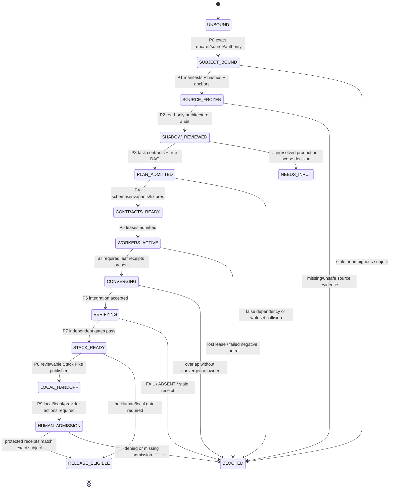
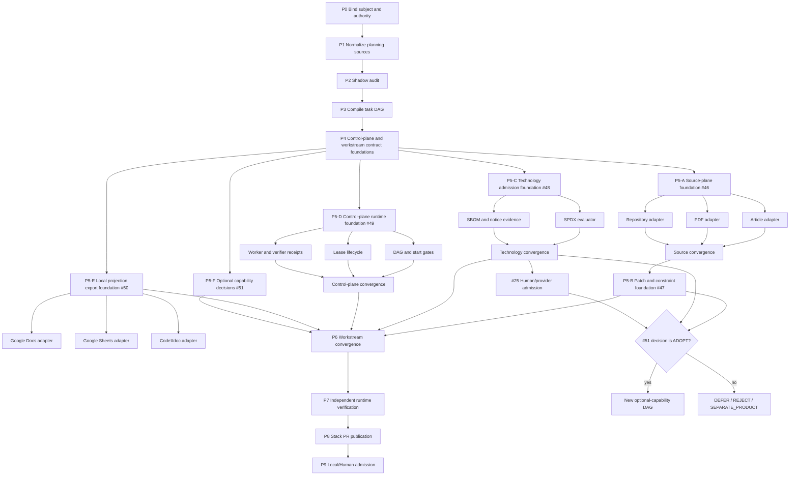

# website-design-compiler

Evidence-first compiler for turning product briefs and observed references into original, accessible, performant, commercially governable web experiences.

The repository is both:

1. the **product compiler** for brief → architecture → page graph → runtime → verification; and
2. the **canonical routing/control center for this product**, holding source identities, issue/PR links, state-machine contracts, evidence receipts, and local handoff pointers.

It is not the canonical home of private shared procedures, credentials, legal decisions, or active local runtime state. Shared methods remain in `ed3c/skills-shared`; Google Docs, Google Sheets, and CodeXdoc are optional projections.

## Truth snapshot

| Subject | Current state |
|---|---|
| Canonical `main` baseline | `4a79d9635911690950f02edda4505672ba7544f6` |
| Current convergence parent | draft PR [#44](https://github.com/ed3c/website-design-compiler/pull/44), `codex/pr42-delivery-v2@9e67222dea5580b1f807266162909422771da99e` |
| Closed compiler/runtime slices | live references, WebGPU fallback evidence, IA/content/visual/tokens/sections/responsive/motion/media/page graph/design quality and release-profile mechanics have runtime-backed closure records on `main` |
| Open production boundary | [#25](https://github.com/ed3c/website-design-compiler/issues/25): real provider/model/output/service rights and protected production execution |
| New architecture program | [#45](https://github.com/ed3c/website-design-compiler/issues/45) with leaves [#46](https://github.com/ed3c/website-design-compiler/issues/46)–[#51](https://github.com/ed3c/website-design-compiler/issues/51) |
| Reviewed user-provided PDF | digest-only subject `sha256:7350f0e3d29ace70a6c92343e5501b34763f452e057d9b8acef3829f57230ef6`, `1878749` bytes; source bytes are not committed |
| Evidence rule | plans, prompts, schemas, and docs do not promote a capability to runtime `PASS` |

Do not merge PR #44 or any child stack while required gates are failing. A fail-closed Human/provider gate is not a compiler regression and is not production proof.

## Architecture kernel

The source material is normalized into this repository’s existing evidence-first architecture rather than copied as a list of libraries:

```text
article / PDF / repository / URL / product brief
                    |
                    v
        immutable source manifest
                    |
                    v
  observed facts + explicit inference boundary
                    |
                    v
       governed brief / DSL / page graph AST
                    |
                    v
  hard constraints + bounded soft optimization
                    |
                    v
 IA -> content -> visual direction -> tokens
                    |
                    v
 section grammar -> responsive composition
                    |
                    v
 page graph -> motion/media/2D/3D strategies
                    |
                    v
 Puck authoring <-> typed AST patches <-> Payload
                    |
                    v
 deterministic renderer and browser execution
                    |
                    v
 a11y / performance / originality / rights gates
                    |
                    v
 release receipt or Local Handoff Execution Queue
```

The core invariant is:

> Primary semantic content and actions remain usable without generated media, provider access, WebGPU, WebGL, 3D, heavy motion, external document systems, or optional collaboration infrastructure.

### Baseline versus optional product tracks

| Track | Position |
|---|---|
| Website compiler kernel | product core |
| Article/PDF/repository source intake | core input-plane gap, issue #46 |
| Typed bidirectional AST patches and constraint boundary | core authoring/compiler gap, issue #47 |
| Exact technology and rights admission | core governance gap, issue #48 |
| Executable Tech Lead/Shadow control plane | core delivery gap, issue #49 |
| Google Docs/Sheets/CodeXdoc | optional projection plane, issue #50 |
| Flair-like 3D product photoshoot | optional product capability; decision under #51 and provider admission under #25 |
| Motion/video composition and encoding | optional release profile or separate product capability |
| DJ/audio DSP and hardware control | separate product unless an explicit product decision changes scope |

## Ten-phase state machine

The program uses ten phases, `P0` through `P9`.



| Phase | Owner | Required output | Handoff gate |
|---|---|---|---|
| P0 Subject and authority freeze | Tech Lead controller | exact repository, base/head SHA, issue/PR, source set, authority matrix | no ambiguous ref or hidden write authority |
| P1 Source normalization | Source steward | immutable source manifests and anchored observations | every claim can point to source bytes/page/path |
| P2 Shadow architecture audit | Shadow architect monitor | closure matrix, contradictions, unknowns, negative controls | read-only; no implementation side effect |
| P3 Task/DAG compilation | Tech Lead planner | typed task packets, start graph, dependency graph, writesets, leases | only true dependencies; explicit convergence owners |
| P4 Contract foundation | Contract worker | schemas, fixtures, invariants, state transitions, failure receipts | contract tests and negative fixtures pass |
| P5 Parallel implementation | bounded workers | molecular leaf results and worker receipts | disjoint leases or managed overlap |
| P6 Convergence | integration owner | integrated tree, conflict decisions, retained objective/invariants | all required predecessors independently verified |
| P7 Runtime verification | independent verifier | build/browser/a11y/performance/originality/rights receipts | exact SHA/ref and artifact hashes match |
| P8 Stacked delivery | Stack PR worker | branch lineage, focused PRs, issue links, review artifacts | oldest-first review; no automatic merge |
| P9 Local/Human admission | local operator + Human owners | protected/local receipts, provider/legal decisions, final release readback | no credential or legal inference by cloud Agent |

Full copyable prompts are in [`docs/architecture/PHASE_SYSTEM_PROMPTS.md`](docs/architecture/PHASE_SYSTEM_PROMPTS.md).

## Task DAG and parallel conversation plan



Open a separate ChatGPT/Agent conversation only for a task packet whose prerequisites are already satisfied. Every conversation receives the same exact-subject envelope and a different role/writeset. Chat history is never a dependency; continuation uses the handoff packet.

Recommended separate sessions are admitted by **start eligibility**, not by one blanket fan-out:

| Session | Issue | Earliest start | Writeset | Must not edit |
|---|---:|---|---|---|
| Source foundation | #46 | control-plane docs accepted | source schemas/manifests/fixtures | compiler/runtime/provider code |
| Article/PDF/repository adapter leaves | #46 | source foundation independently verified | one adapter-specific path plus fixtures/tests | sibling adapter paths |
| Patch/constraint kernel | #47 | source convergence accepted | `src/compiler-kernel/**`, matching schemas/tests | source adapters and rights policy |
| Technology admission | #48 | control-plane docs accepted | rights/admission schemas, registry, SBOM/notice scripts/tests | provider credentials or legal decisions |
| Control-plane runtime | #49 | control-plane docs accepted | `src/control-plane/**`, control-plane schemas/fixtures/tests | product compiler behavior |
| Local projection export | #50 | control-plane docs accepted | `src/projections/export-bundle.ts`, export fixtures/tests | canonical issue/evidence state |
| Google Docs/Sheets/CodeXdoc adapters | #50 | local export foundation accepted | one provider adapter path each | sibling provider adapters |
| Optional-track decision | #51 | control-plane docs accepted | decision records and proof-of-contract fixtures only | product-core dependencies before ADOPT |
| Optional-track implementation | new child DAG | only after `ADOPT` plus #47/#48 and #25 when applicable | capability-specific | baseline core without an admitted dependency |

## Directory ownership

### Current repository planes

```text
.
├── .agents/
│   ├── bindings/                  # exact private shared-skill binding metadata
│   └── control-plane/             # public-safe static capability/authority profile
├── .github-delivery/              # publication dashboard, metrics and receipts
├── .github/workflows/             # canonical CI/release evidence lanes
├── .skill-bindings/               # public consumer bindings; no private skill bodies
├── apps/site/                     # Next.js authoring, showcase and benchmark runtime
├── artifacts/                     # generated receipts; normally runtime-produced
├── docs/
│   ├── architecture/              # product and control-plane architecture SSOT
│   └── issues/                    # issue-specific evidence boundaries and handoffs
├── fixtures/                      # deterministic positive and negative subjects
├── policies/                      # release, rights, capability and budget policies
├── schemas/                       # machine-readable artifact/receipt contracts
├── scripts/                       # receipt generators and verification runners
├── skills/                        # repository-owned website-design skills
├── src/                           # compiler, adapters, gates and runtime contracts
└── tests/                         # deterministic and browser verification
```

### Planned new implementation namespaces

```text
src/
├── source-plane/
│   ├── manifest.ts
│   ├── observations.ts
│   ├── article-adapter.ts
│   ├── pdf-adapter.ts
│   └── repository-adapter.ts
├── compiler-kernel/
│   ├── page-graph-patch.ts
│   ├── constraint-model.ts
│   └── solver-adapter.ts
├── control-plane/
│   ├── program.ts
│   ├── task-packet.ts
│   ├── dag.ts
│   ├── lease.ts
│   ├── convergence.ts
│   └── local-handoff.ts
└── projections/
    ├── export-bundle.ts
    ├── google-docs.ts
    ├── google-sheets.ts
    └── codexdoc.ts

schemas/
├── source-manifest.schema.json
├── source-observation.schema.json
├── page-graph-patch.schema.json
├── technology-admission.schema.json
├── control-plane-program.schema.json
├── task-packet.schema.json
├── execution-lease.schema.json
├── worker-result.schema.json
├── verifier-receipt.schema.json
├── local-handoff-queue.schema.json
└── document-projection.schema.json
```

Existing stable flat modules do not need a cosmetic move. New namespaces isolate new contracts and reduce writeset collisions.

## Control and routing hierarchy

1. **Git and repository artifacts** — canonical code, schemas, policies, manifests, receipts.
2. **GitHub Issues/PRs** — canonical execution ledger, dependencies, review and delivery identity.
3. **`ed3c/skills-shared`** — canonical shared process methods, pinned by exact binding; never vendored here.
4. **Google Docs** — optional human-readable architecture/review projection.
5. **Google Sheets** — optional registry/status/dashboard projection.
6. **CodeXdoc** — optional documentation adapter; never a required build or evidence dependency.
7. **Local/private carrier** — secrets, machine paths, active leases, protected provider bundles and Human admissions; never published.

`website-design-compiler` should be the routing center for **this product**, not a universal router for every repository. Cross-repository procedure stays in `skills-shared`. `bettor-arena` may later supply evaluator/tournament patterns through an explicit adapter, but it is not required for the first closure wave.

## Stacked PR index

The current true stack is:

```text
main@4a79d963
└── codex/pr42-delivery-v2@9e67222d       PR #44
    └── agent/shadow-architect-control-plane
```

Planned molecular deliveries are listed in [`docs/architecture/STACKED_PR_INDEX.md`](docs/architecture/STACKED_PR_INDEX.md). Rules:

- one independently reviewable behavior per branch;
- only real implementation dependencies become parent/child branch relationships;
- independent leaves use separate stacks and may run in parallel;
- shared files have one convergence owner;
- every PR links its issue, parent branch/PR, exact test commands, negative controls and evidence artifacts;
- merge oldest-first;
- automatic merge and conflict resolution remain disabled.

Git Town is a local convenience, not evidence by itself. Branch ancestry, exact commits, CI receipts and review remain authoritative.

## Local Handoff Execution Queue

The queue is defined in [`docs/architecture/LOCAL_HANDOFF_EXECUTION_QUEUE.md`](docs/architecture/LOCAL_HANDOFF_EXECUTION_QUEUE.md). Current hard boundaries include:

- PR #44 / issue #25 rights and real-provider admission;
- protected variables/secrets and trusted signing authority;
- local Git Town installation/configuration;
- private source byte handling and publication decisions;
- physical browser/GPU/device evidence when a capability claims it;
- Google Workspace OAuth/permission setup for optional projections;
- final merge and release promotion.

A queue item must name the exact subject, owner, blocking reason, commands, required secret/hardware names, expected artifacts, completion gate and resume target. It must never contain secret values.

## Automation boundary

Mechanical execution can be highly automated:

- source acquisition under policy, hashing, parsing and anchoring;
- gap classification and task/DAG generation;
- branch/worktree/PR/issue operations;
- deterministic code generation, tests, browser lanes and evidence packaging;
- document export bundles and drift detection;
- queue generation and resume packets.

End-to-end release cannot be fully autonomous because these remain Human or local authority:

- source publication permission;
- legal/license/model/output/service-right decisions;
- credentials, quotas, billing and protected variables;
- physical hardware or private-network claims;
- final conflict resolution, merge and production promotion.

The correct target is **fully automated mechanics with fail-closed Human admission**, not unattended production authority.

## Architecture documents

- [`COMPILER_PIPELINE.md`](docs/architecture/COMPILER_PIPELINE.md) — product compiler contracts.
- [`SHADOW_ARCHITECT_CONTROL_PLANE.md`](docs/architecture/SHADOW_ARCHITECT_CONTROL_PLANE.md) — closure audit and control-plane design.
- [`PHASE_SYSTEM_PROMPTS.md`](docs/architecture/PHASE_SYSTEM_PROMPTS.md) — copyable prompts for each phase/session.
- [`SOURCE_AND_TECHNOLOGY_REGISTRY.md`](docs/architecture/SOURCE_AND_TECHNOLOGY_REGISTRY.md) — source, technology and document routing rules.
- [`STACKED_PR_INDEX.md`](docs/architecture/STACKED_PR_INDEX.md) — molecular branch/PR topology.
- [`LOCAL_HANDOFF_EXECUTION_QUEUE.md`](docs/architecture/LOCAL_HANDOFF_EXECUTION_QUEUE.md) — zero-context local/Human continuation.
- [`control-plane-program.json`](docs/architecture/control-plane-program.json) — public-safe machine-readable phase/DAG seed.
