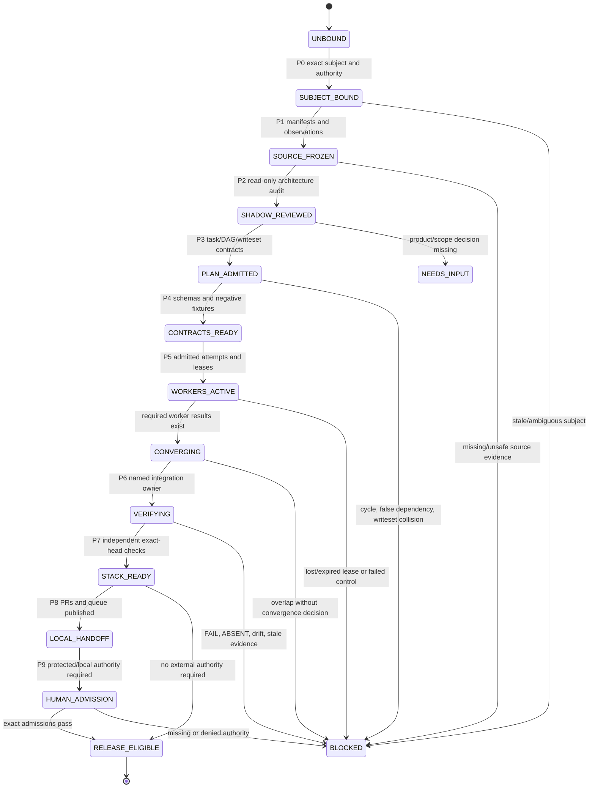
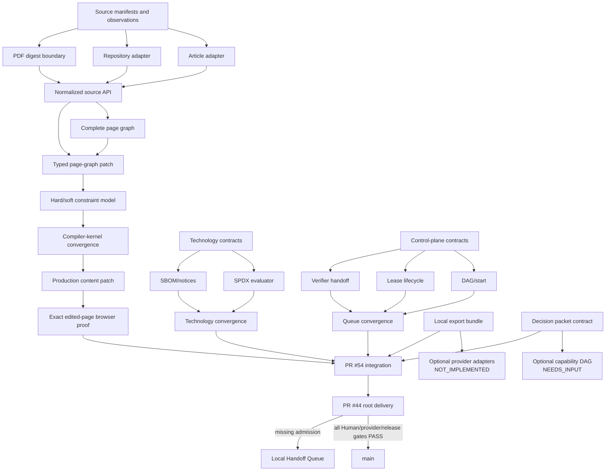

# website-design-compiler

Evidence-first compiler for turning product briefs and observed sources into original, accessible, performant, commercially governable web experiences.

The repository is both:

1. the **product compiler** for source/brief → governed page graph → authoring/runtime → verification; and
2. the **product-specific control center** for source identities, issue/PR topology, state-machine contracts, evidence receipts, and Local Handoff routing.

It is not the canonical home of private shared procedures, credentials, protected source bytes, legal decisions, active private scheduler state, or unattended release authority. Shared process methods remain in `ed3c/skills-shared` and are consumed through exact public-safe bindings.

## Current truth snapshot

Reviewed implementation convergence before this documentation refresh:

```yaml
repository: ed3c/website-design-compiler
canonical_main_sha: 4a79d9635911690950f02edda4505672ba7544f6
root_delivery_pr: 44
root_delivery_branch: codex/pr42-delivery-v2
root_delivery_head: 9e67222dea5580b1f807266162909422771da99e
integration_pr: 54
integration_branch: agent/shadow-architect-control-plane
integrated_code_head: c58958ee30e76d8aa9ad9388e6bf10adbd5a7db5
planning_pdf_sha256: 7350f0e3d29ace70a6c92343e5501b34763f452e057d9b8acef3829f57230ef6
planning_pdf_byte_length: 1878749
planning_pdf_publication: DIGEST_ONLY
```

Documentation commits after the integrated code head update architecture/routing truth only. Any later implementation change requires fresh exact-head verification.

### State summary

| Plane | What is integrated | Current boundary |
|---|---|---|
| Existing product compiler | brief, IA/content, visual direction, tokens, governed sections, responsive composition, motion/media/2D/3D strategies, page/site graph, Puck, Payload, browser and release evidence mechanics | release remains fail-closed on missing Human/provider admissions |
| Source plane | immutable manifests, exact observations, separate inference, supplied article adapter, exact repository snapshot adapter, parser-neutral PDF boundary | real PDF parser `NOT_EXERCISED`; general URL adapter `NOT_IMPLEMENTED` (#72) |
| Compiler kernel | exact-base typed patches, conflict/reject states, inverse history, hard/soft constraints, production content patch, exact edited-page browser proof | durable evidence hardening remains #149; generic solver remains `NOT_ADMITTED` |
| Technology governance | exact candidate identities, separated rights subjects, revocation, SPDX expressions, SBOM/notices, engineering convergence | no Human/legal/provider admission is inferred; #25 remains open |
| Control plane | task/program contracts, DAG/start eligibility, replay-safe leases, independent verifier handoff, Local Handoff Queue compiler | active private scheduler/worktree carrier was not exercised by cloud CI |
| Projection plane | deterministic local Markdown, CSV and JSON export with drift identity | Google Docs/Sheets/CodeXdoc adapters and OAuth are absent |
| Optional tracks | evidence-bound decision packet contract for 3D/video/audio | tests are synthetic; no Human product outcome is frozen; implementation is not eligible |
| Delivery | five verified convergence carriers merged into PR #54's branch | PR #44 must not merge to `main` while required gates fail |

Read [`docs/architecture/SHADOW_ARCHITECT_MONITOR.md`](docs/architecture/SHADOW_ARCHITECT_MONITOR.md) for the full closure matrix and blockers.

## Evidence model

These terms are intentionally distinct:

- **IMPLEMENTED** — code or contract exists.
- **VERIFIED** — exact-subject commands and negative controls passed.
- **INTEGRATED** — verified commits are reachable from the integration branch.
- **ADMITTED** — required engineering, Human, legal, provider, source-publication, credential, or physical authority accepted the exact subject.
- **RELEASED** — the exact subject passed the release profile and was promoted by an authorized owner.

`IMPLEMENTED`, `VERIFIED`, and `INTEGRATED` do not imply `ADMITTED` or `RELEASED`.

Repository evidence states:

```text
PASS | FAIL | ABSENT | NOT_IMPLEMENTED | NOT_EXERCISED
SKIPPED_BY_POLICY | NEEDS_INPUT | BLOCKED
```

A plan, prompt, schema, branch, PR, fixture, or receipt shell cannot become runtime `PASS` by description alone.

## Architecture kernel

```text
article / PDF / exact Git snapshot / URL / product brief
                         |
                         v
             immutable source manifest
                         |
                         v
      anchored observations + separate inference
                         |
                         v
          governed brief and content contract
                         |
                         v
     IA -> visual direction -> semantic tokens
                         |
                         v
     governed sections -> responsive composition
                         |
                         v
              complete page/site graph
                         |
             +-----------+-----------+
             |                       |
             v                       v
 source-bound typed patch       motion/media/2D/3D
             |                       |
             v                       |
 hard/soft constraints <-------------+
             |
             v
      accepted result page graph
             |
       +-----+------------------+
       |                        |
       v                        v
 Puck/Payload projection   semantic runtime
       |                        |
       +-----------+------------+
                   v
 browser/a11y/performance/originality evidence
                   |
 technology/SPDX/SBOM/rights evidence
                   |
         release gate or Local Handoff Queue
```

Core invariant:

> Primary semantic content and actions remain usable without generated media, provider access, WebGPU, WebGL, 3D, heavy motion, external document systems, or optional collaboration infrastructure.

## Global program state machine



| Phase | Owner | Exit artifact |
|---|---|---|
| P0 subject/authority freeze | Tech Lead controller | exact-subject envelope and authority matrix |
| P1 source normalization | source steward | immutable manifests and anchored observations |
| P2 Shadow audit | read-only Shadow monitor | closure matrix, unknowns, negative controls |
| P3 task/DAG compilation | Tech Lead planner | task packets, dependency/start graphs, writesets |
| P4 contract foundation | contract worker + independent verifier | schemas, invariants, fixtures, state transitions |
| P5 parallel implementation | leased workers | molecular results and worker receipts |
| P6 convergence | named integration owner | integrated tree and overlap decisions |
| P7 runtime verification | independent verifier | exact-head build/browser/rights receipts |
| P8 stacked delivery | Stack PR worker | branch lineage, PRs, issue links, review artifacts |
| P9 local/Human admission | local operator/Human authority | protected/local receipts or truthful blocker |

Copyable role prompts are in [`docs/architecture/PHASE_SYSTEM_PROMPTS.md`](docs/architecture/PHASE_SYSTEM_PROMPTS.md).

## Directory ownership, state machines, and data flow

### Repository map

```text
.
├── .agents/
│   ├── bindings/                    # exact shared-process binding metadata
│   └── control-plane/               # public-safe authority/capability profiles
├── .github-delivery/                # delivery dashboards and publication receipts
├── .github/workflows/               # CI, browser, evidence, release lanes
├── .skill-bindings/                 # public bindings; no private skill bodies
├── apps/site/                       # Next.js runtime, benchmarks, Puck studio
├── artifacts/                       # generated receipts and runtime evidence
├── docs/
│   ├── architecture/                # architecture, monitor, stack, queue SSOT
│   └── issues/                      # issue-specific boundaries and handoffs
├── fixtures/                        # deterministic positive/negative subjects
├── policies/                        # release, rights, capability, budget policies
├── schemas/                         # strict machine-readable contracts
├── scripts/                         # evidence producers and verifiers
├── skills/                          # repository-owned website-design skills
├── src/
│   ├── source-plane/                # source identity and observations
│   ├── compiler-kernel/             # patches, constraints, production edits
│   ├── control-plane/               # task/DAG/lease/verifier/handoff runtime
│   ├── projections/                 # local export bundle
│   ├── technology-admission.ts      # exact candidate/right identities
│   ├── spdx-policy.ts               # SPDX expression evaluation
│   ├── sbom-notice.ts               # SBOM/notice evidence
│   ├── technology-convergence.ts    # engineering evidence join
│   └── optional-capability-decisions.ts
└── tests/                            # unit, negative, integration, browser proof
```

### Plane contracts

| Path | Owner | Local state machine | Consumes | Produces |
|---|---|---|---|---|
| `src/source-plane/` | source steward | `UNBOUND → MANIFESTED → OBSERVED`; PDF may stop at `NOT_EXERCISED` | exact bytes/Git/PDF request | manifest, observations, inference, parse boundary receipt |
| `src/compiler-kernel/` | compiler-kernel owner | `PROPOSED → CONFLICT/REJECTED/APPLIED → REVERTED`; solver `NOT_REQUIRED/REQUIRED_NOT_ADMITTED` | page graph, source observations, typed patch | candidate/result graph, constraint report, patch/revert receipt |
| technology modules | technology-governance owner | `CANDIDATE → ALLOW/REVIEW_REQUIRED/DENY/UNKNOWN → REVOKED` | exact candidate, rights, SPDX, SBOM/notice evidence | engineering admission/convergence receipts |
| `src/control-plane/` | Tech Lead control-plane owner | task `QUEUED/BLOCKED/READY/RUNNING/REVIEW_REQUIRED/COMPLETE`; lease `ACTIVE/CHECKPOINTED/RELEASED/LOST/EXPIRED` | program/task/predecessor/execution evidence | start receipt, lease snapshot, verifier handoff, queue record |
| `src/projections/` | projection owner | `CURRENT/DRIFTED/UNKNOWN` | canonical records and templates | deterministic Markdown/CSV/JSON bundle |
| optional decision module | product architecture owner | `ADOPT/DEFER/REJECT/SEPARATE_PRODUCT` | source evidence and Human decision | decision packet; possible future DAG eligibility |
| `apps/site/` | runtime/authoring owner | compiled → authored/persisted → rendered | complete graph, Puck/Payload projections | semantic runtime and browser-observable identity |
| `scripts/` | evidence producer | input-bound → executed → receipt written | exact artifacts/config | receipts, durable evidence packages |
| `schemas/` | contract owner | proposed → validated → versioned | artifact structures | strict validation boundary |
| `tests/` | independent verifier | positive/negative → PASS/FAIL | implementation and fixtures | exact verification evidence |
| `docs/architecture/` | architecture convergence owner | proposed → reviewed → current/superseded | code/issue/PR truth | routing, monitor, Stack PR index, handoff queue |

### Current implementation DAG



## Real-problem closure

| Problem | Closed mechanical scope | Still open |
|---|---|---|
| Article/source grounding | supplied UTF-8/Markdown bytes, exact line observations, publication policy | live HTML/network capture |
| Repository grounding | exact commit/tree/path/range snapshots | unrestricted remote acquisition |
| PDF grounding | exact digest/length/policy boundary with truthful `NOT_EXERCISED` receipt | admitted parser, real page observations, source publication decision |
| URL grounding | existing low-level public-target protections can be reused | general source URL adapter #72 |
| Authoring round-trip | exact-base patches, provenance, conflicts, inverse history, Puck/Payload round-trip | optional CRDT/canvas/solver only with new requirements |
| Production content edit | section and embedded content contract update atomically | no open acceptance blocker; evidence hardening is #149 |
| Constraint system | hard vs soft findings and falsifiable solver decision | general solver remains intentionally not admitted |
| Browser binding | exact edited graph rendered across desktop/tablet/mobile/reduced motion with screenshot hashes | observation-byte/atomic artifact hardening #149 |
| Technology governance | exact identities, separate rights subjects, SPDX expressions, SBOM/notices, revocation | Human legal/provider admission #25 |
| Agent execution model | deterministic program/task/DAG/start/lease/verifier/handoff/queue contracts | active private scheduler/worktree carrier |
| Document projection | local Markdown/CSV/JSON export and drift identity | Google Docs/Sheets/CodeXdoc adapters and OAuth |
| 3D/video/audio scope | decision packet contract | real evidence-bound product outcomes and any new implementation DAG |
| Production release | fail-closed release mechanics | credentials, provider execution, Human rights/visual/Storybook admission, authorized `main` merge |

## Integrated Stack PR topology

Only two PRs remain open:

```text
main
└── PR #44  codex/pr42-delivery-v2            [OPEN, DRAFT, MAIN MERGE BLOCKED]
    └── PR #54  agent/shadow-architect-control-plane [OPEN, INTERNAL INTEGRATION]
```

PR #54 contains these merged convergence carriers:

| Carrier | Internal merge commit | Molecular trace |
|---:|---|---|
| #148 source/kernel/browser | `ace73bc7b9eba7c460c3489a18ccd4b0ba1fc6a0` | #55, #124, #125, #132, #137, #142, #143, #144, #147, #148 |
| #136 technology | `13711eb0e3adad1479cc059252fbea55a208b650` | #126, #127, #128, #136 |
| #138 control plane | `905fc4320f8ffc39dc104b373c1bafcc5783773a` | #131, #133, #134, #135, #138 |
| #129 projection | `270d32402da1404c5e412077ccbf9d4e6805d887` | #129 |
| #130 decision contract | `c58958ee30e76d8aa9ad9388e6bf10adbd5a7db5` | #130 |

Molecular PRs whose commits were incorporated through carriers are closed as **MATERIALIZED**, not falsely described as separate `main` merges. Full exact heads and dispositions are in [`STACKED_PR_INDEX.md`](docs/architecture/STACKED_PR_INDEX.md).

Git Town is a local branch-management aid, not evidence. Automatic conflict resolution, automatic `main` merge, and unattended release remain disabled.

## Local Handoff Execution Queue

The current queue is in [`LOCAL_HANDOFF_EXECUTION_QUEUE.md`](docs/architecture/LOCAL_HANDOFF_EXECUTION_QUEUE.md).

| Queue | Boundary |
|---|---|
| LHQ-001 | real provider, credentials, exact provider/model/output/service rights, protected execution |
| LHQ-002 | local Git Town/worktree topology and optional active private scheduler carrier |
| LHQ-003 | real PDF parser and source-publication decision |
| LHQ-004 | Google Docs/Sheets/CodeXdoc adapters, OAuth, target IDs, provider readback |
| LHQ-005 | Human product decisions for 3D/video/audio tracks |
| LHQ-006 | exact-head PR #54/PR #44 verification, final `main` merge and release |
| LHQ-007 | admitted general URL acquisition adapter |
| LHQ-008 | atomic self-verifying edited-browser evidence package (#149) |

Queue items name secret/hardware **names**, never values. They include exact subject, owner, blocker, prerequisites, writeset, commands, artifacts, negative controls, completion gate, and resume target.

## Verification

Core commands:

```bash
pnpm install --frozen-lockfile
pnpm typecheck
pnpm build
pnpm test
pnpm ui:typecheck
pnpm ui:build
pnpm browser:typecheck
pnpm storybook:typecheck
pnpm arena:typecheck
```

The GitHub Actions compiler-core workflow additionally runs compiler stages, rights/provenance checks, authoring and Payload CMS fixtures, Storybook, browser/runtime projects, design-quality calibration, accessibility/performance, Arena, evidence packaging, and release receipts.

A final aggregate workflow failure may be intentional when Human-controlled admission is absent. Inspect every step: implementation checks must pass, while Human/provider/release gates remain explicit failures rather than being bypassed.

## Merge policy

- PR #54 may merge only into PR #44's branch after fresh exact-head implementation verification.
- PR #44 must remain draft and must not merge to `main` while issue #25 or required visual, Storybook, repository-rights, provider, or release gates are absent/failing.
- No Agent may infer protected hashes, credentials, waivers, legal decisions, physical evidence, provider execution, or release readiness.
- Issue #43 closes only after PR #44 reaches canonical `main` and the resulting main SHA is read back.

## Architecture documents

- [`SHADOW_ARCHITECT_MONITOR.md`](docs/architecture/SHADOW_ARCHITECT_MONITOR.md) — current closure audit, blockers, PR/issue disposition, merge decision.
- [`STACKED_PR_INDEX.md`](docs/architecture/STACKED_PR_INDEX.md) — exact molecular and convergence PR topology.
- [`LOCAL_HANDOFF_EXECUTION_QUEUE.md`](docs/architecture/LOCAL_HANDOFF_EXECUTION_QUEUE.md) — zero-context local/Human continuation.
- [`COMPILER_PIPELINE.md`](docs/architecture/COMPILER_PIPELINE.md) — product compiler contracts.
- [`SHADOW_ARCHITECT_CONTROL_PLANE.md`](docs/architecture/SHADOW_ARCHITECT_CONTROL_PLANE.md) — control-plane design.
- [`PHASE_SYSTEM_PROMPTS.md`](docs/architecture/PHASE_SYSTEM_PROMPTS.md) — role prompts for P0–P9.
- [`SOURCE_AND_TECHNOLOGY_REGISTRY.md`](docs/architecture/SOURCE_AND_TECHNOLOGY_REGISTRY.md) — source, technology, and document routing rules.
- [`control-plane-program.json`](docs/architecture/control-plane-program.json) — public-safe machine-readable program seed.
- [`AGENTS.md`](AGENTS.md) — mandatory Agent contract and current integration boundary.

## License

Public/open-source project files use Apache License 2.0 (`Apache-2.0`) unless an imported upstream component requires a separate third-party notice or source-preserving boundary.
