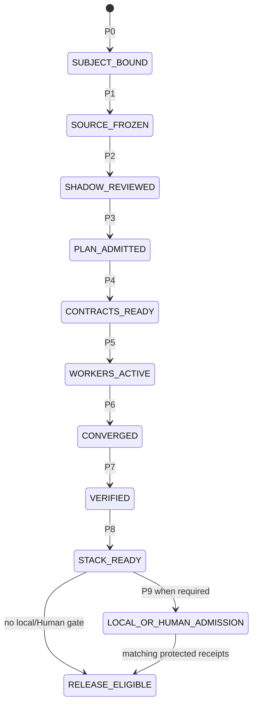
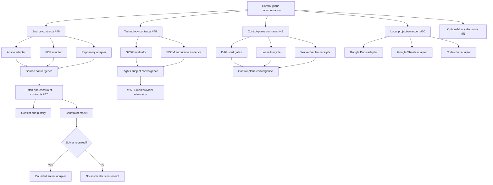

# Website Design Compiler Pipeline

## Goal

Translate a product brief and optional design references into a deployable website with explicit design contracts, runtime verification, provenance, and release receipts.

## Pipeline

```text
natural-language brief -> brief-normalization -> structured compiler input
structured compiler input -> information-architecture
information-architecture -> content-architecture
references -> reference-intelligence
reference-intelligence -> art-direction -> visual-direction-search -> design-system-compiler
information-architecture + content-architecture + selected visual direction + design-system-compiler
  -> page-architect
  -> frontend-builder
  -> motion / 2d / 3d / media specialists
  -> browser-visual-qa
  -> accessibility-performance
  -> originality-gate
  -> license-provenance-gate
  -> release-receipt
```

## Contract boundaries

### Brief normalization

Converts natural-language requirements into a structured compiler input. Required facts, hard constraints, and evidence-sensitive content requests remain explicit; missing or contradictory inputs produce `NEEDS_INPUT` rather than guessed values.

Required output:
- `brief-normalization.json`

### Information architecture

Produces a page-family-specific section graph. Every section records its supporting brief evidence, required content, missing content, fallback, and `READY | NEEDS_INPUT` status. A brief objective can inform planning intent, but it cannot silently become publishable headline, action, proof, or product copy.

Required output:
- `information-architecture.json`

### Content architecture

Turns each IA content requirement into a provenance-bound authoring field with a source classification, publishability decision, responsive length budget, locale policy, and quality findings. Brief objectives remain planning evidence; they are not publishable headlines, product claims, or action labels. Explicit `authoredContent` values are keyed by an IA-owned slot and retain `compiler.authoredContent:<slot>` provenance; unknown slots fail fast. Missing authored content produces `NEEDS_INPUT` in the artifact and `ABSENT` in the runtime stage receipt.

Required output:
- `content-architecture.json`

### Visual direction search

Generates multiple structured candidates, measures pairwise diversity, and selects exactly one direction. Originality distance is computed only from source-bound observed visual fingerprints; when none are supplied, the artifact reports `NOT_EXERCISED` instead of manufacturing a score from unrelated hashes. The selected search receipt is passed directly to the design-system compiler and cannot be silently rerun with another seed.

Required output:
- `visual-direction-search.json`

### Reference intelligence
Produces observable facts only. It may describe layout, typography, motion, assets, hierarchy, and interaction patterns, but must not claim unknown implementation details as facts.

Required outputs:
- `reference-manifest.json`
- `reference-analysis.md`
- `originality-plan.md`

### Art direction
Exactly one primary art-direction policy is active per build. Other taste systems may review but must not compete as equal authorities.

Required outputs:
- `design-read.json`
- `DESIGN.md`

### Design system compiler
Converts visual direction into semantic tokens, states, responsive rules, motion policy, and media treatment.

Required outputs:
- `semantic-tokens.json`
- `component-state-matrix.json`
- `motion-spec.json`
- `scene-spec.json`

### Implementation specialists
The semantic DOM and primary actions must remain functional independently of decorative WebGL, heavy video, or generated media. 2D, 3D, and cinematic motion are opt-in specialist layers.

### Verification
Verification must execute the built artifact. Source inspection alone cannot yield PASS.

Minimum gates:
- typecheck/build
- browser smoke
- desktop/tablet/mobile screenshots
- keyboard path
- reduced-motion path
- WebGL failure/static fallback path when applicable
- console/network errors
- accessibility
- performance budget
- originality
- dependency and asset provenance

### Receipt
A release receipt binds the tested commit, selected skill versions, commands, artifacts, gate results, known deviations, and unresolved risks.

## Evidence states

`PASS | FAIL | ABSENT | NOT_IMPLEMENTED | NOT_EXERCISED | SKIPPED_BY_POLICY`

## Public/private boundary

`skills-shared` is private and canonical for shared procedures. This public repository stores only explicit binding metadata and repo-owned website-design compiler skills. Private skill bodies, live machine paths, credentials, and private runtime state must never be published here.

## Multi-source source plane

Program [#45](https://github.com/ed3c/website-design-compiler/issues/45) extends the input boundary from briefs and live references to article, PDF, exact repository and technology-candidate subjects.

```text
article bytes --------┐
PDF bytes ------------┤
public URL capture ----┤
repository commit/path ├──> source-manifest/v1
technology subject ----┘          |
                                  v
                         source-observation/v1
                                  |
                    +-------------+-------------+
                    |                           |
                    v                           v
             observed facts             explicit inference
                    |                           |
                    +-------------+-------------+
                                  v
                       architecture finding
                                  |
                                  v
                 brief / IA / content / design contracts
```

Each source identity must record exact bytes or repository commit/tree/path, parser identity/version, anchors, extraction warnings, access/publication classification and SHA-256. A planning review or copied excerpt is not a runtime source-manifest receipt.

The reviewed user-provided PDF is currently a digest-only planning subject:

```yaml
source_id: modern-web-design-architecture-extension-2026-08-18
media_type: application/pdf
byte_length: 1878749
sha256: 7350f0e3d29ace70a6c92343e5501b34763f452e057d9b8acef3829f57230ef6
public_bytes_committed: false
runtime_manifest_state: NOT_IMPLEMENTED
owning_issue: 46
```

The existing live-reference adapter remains the network acquisition boundary. Issue #46 must not weaken its SSRF, redirect, content-drift, credential, deterministic-CI or publication controls.

## Compiler-kernel extension

The architecture thesis `DSL/AST + constraints + bidirectional editing + deterministic verification` is mapped onto the existing governed page graph rather than implemented as a second compiler.

Issue [#47](https://github.com/ed3c/website-design-compiler/issues/47) owns the missing kernel contracts:

```text
source-bound compiler inputs
          |
          v
canonical page graph + node identities
          |
          +----> deterministic hard-constraint passes
          |
          +----> typed page-graph-patch/v1
                        |
                        +----> precondition/base-digest validation
                        +----> conflict/stale refusal
                        +----> reversible provenance-preserving history
                        +----> Puck/Payload projection and round-trip
          |
          +----> measured solver decision
                        |
                        +----> no solver: explicit sufficiency receipt
                        +----> solver required: bounded adapter with
                               version/config/seed/timeout/non-convergence receipt
```

Hard semantic, accessibility, provenance, rights and release constraints always dominate soft design-quality objectives. Canvas coordinates cannot become the sole semantic layout truth.

## Optional capability tracks

The product compiler baseline does not automatically absorb every product analogy or technology named by a source.

Issue [#51](https://github.com/ed3c/website-design-compiler/issues/51) records one of:

`ADOPT | DEFER | REJECT | SEPARATE_PRODUCT`

for each optional track:

- Flair-like 3D product photoshoot;
- motion/video composition and encoding;
- DJ/audio DSP, beat analysis and hardware control.

An adopted track receives a new capability-specific issue DAG, exact technology admission under [#48](https://github.com/ed3c/website-design-compiler/issues/48), production provider admission under [#25](https://github.com/ed3c/website-design-compiler/issues/25) when applicable, deterministic fallbacks and a separate release profile. Until then it stays outside baseline product dependencies and mandatory CI.

## Orchestration overlay

The product pipeline and the delivery control plane are separate state machines.



Phase definitions, system prompts and handoff packet shapes are in:

- [`SHADOW_ARCHITECT_CONTROL_PLANE.md`](SHADOW_ARCHITECT_CONTROL_PLANE.md)
- [`PHASE_SYSTEM_PROMPTS.md`](PHASE_SYSTEM_PROMPTS.md)
- [`control-plane-program.json`](control-plane-program.json)

## True workstream DAG



Independent leaves can run in separate Agent/ChatGPT sessions only after their own start gate is satisfied. Shared files have one convergence owner. The stack topology is maintained in [`STACKED_PR_INDEX.md`](STACKED_PR_INDEX.md).

## Technology and rights boundary

Technology names are candidates, not dependencies. Issue #48 must pin exact package/repository/model/provider identity, version/commit/revision, distribution hash, license expression and text, transitive subjects, runtime role, notices and revocation state.

Software license, model-weight license, generated-output terms, hosted-service terms, data-use terms and asset/font/media rights are independent subjects. Compound SPDX expressions require expression-aware evaluation; substring blacklists and package-name reputation are insufficient evidence.

Unknown, changed, review-required or denied product-core subjects fail closed. The canonical Human/provider continuation remains issue #25 and the [`LOCAL_HANDOFF_EXECUTION_QUEUE.md`](LOCAL_HANDOFF_EXECUTION_QUEUE.md).

## Document projection boundary

Git commits, machine-readable artifacts, GitHub issues and pull requests remain canonical.

Google Docs, Google Sheets and CodeXdoc are optional one-way projections under issue #50:

```text
canonical repository artifacts
             |
             v
deterministic Markdown / CSV / JSON export
             |
       +-----+------+----------------+
       |            |                |
       v            v                v
 Google Docs   Google Sheets      CodeXdoc
 narrative     registry/status    optional docs
```

Every projection records the exact source digest, target document identity, template/version, access classification, write result and drift state. Projection outage or revoked access cannot block compiler, verification or release lanes.

## Closed-loop rule

An architecture capability is closed only when the chain is complete:

```text
source identity and anchors
  -> real problem and invariant
  -> typed contract and state transition
  -> implementation
  -> deterministic positive and negative fixtures
  -> independent runtime verification
  -> exact branch/commit/PR identity
  -> release receipt or Local Handoff Queue
```

Documentation, system prompts, sample code, product analogies and schemas are planning evidence. They never promote runtime state by themselves.
