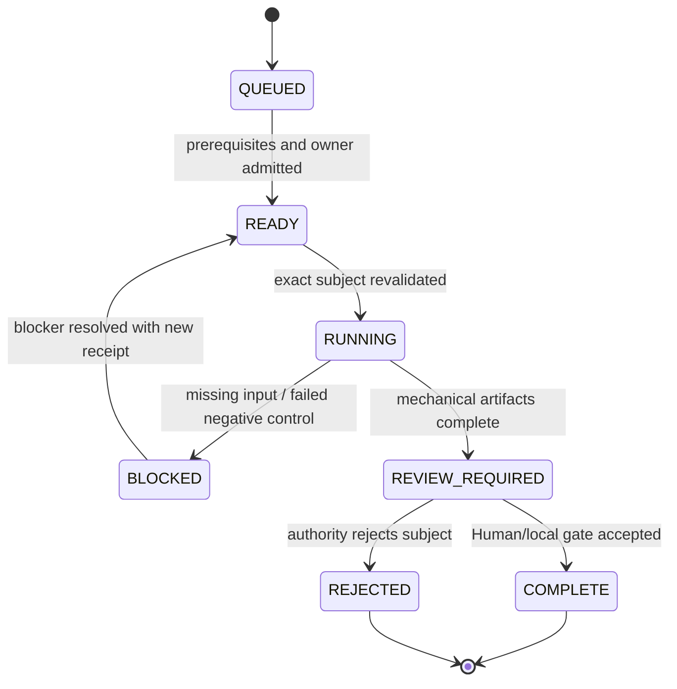

# Local Handoff Execution Queue

## Purpose

This queue is the zero-context continuation boundary for work that cannot be truthfully completed by a public/cloud Agent alone.

Program: [#45](https://github.com/ed3c/website-design-compiler/issues/45)

Exact planning subject:

```yaml
repository: ed3c/website-design-compiler
canonical_main_sha: 4a79d9635911690950f02edda4505672ba7544f6
convergence_parent:
  pull_request: 44
  branch: codex/pr42-delivery-v2
  sha: 9e67222dea5580b1f807266162909422771da99e
control_plane_branch: agent/shadow-architect-control-plane
control_plane_pull_request: 54
production_provider_issue: 25
```

The queue does not contain credential values, private machine paths, legal conclusions, unpublished source bytes, or active lease tokens. It names required inputs, commands, expected artifacts, completion gates and resume targets.

## Queue state model



Allowed states:

`QUEUED | READY | RUNNING | BLOCKED | REVIEW_REQUIRED | COMPLETE | REJECTED | SUPERSEDED`

A queue item is immutable with respect to its exact subject. A changed branch head, source digest, provider/model revision, policy, command set, or protected evidence identity creates a new queue revision.

## Queue item contract

```yaml
queue_id: LHQ-000
revision: 1
state: QUEUED
program_issue: 45
owning_issue: 0
subject:
  repository: ed3c/website-design-compiler
  base_ref: refs/heads/main
  base_sha: <sha>
  head_ref: <ref>
  head_sha: <sha>
  source_digests: []
owner:
  role: <local-operator|legal-reviewer|provider-admin|release-owner>
  github_identity: <identity-or-UNASSIGNED>
blocking_reason: <reason>
prerequisites: []
required_inputs:
  non_secret: []
  protected_names: []
  hardware: []
commands: []
expected_artifacts: []
negative_controls: []
completion_gate: <falsifiable condition>
resume_target:
  issue: <number>
  pull_request: <number-or-null>
  phase: <P0-P9>
  command: <command-or-NOT_APPLICABLE>
public_comment_template: <safe summary>
```

## Active queue

### LHQ-001 — Production rights and real-provider admission

```yaml
queue_id: LHQ-001
revision: 1
state: BLOCKED
program_issue: 45
owning_issue: 25
subject:
  repository: ed3c/website-design-compiler
  convergence_parent_pr: 44
  branch: codex/pr42-delivery-v2
  sha: 9e67222dea5580b1f807266162909422771da99e
owner:
  role:
    - legal_or_rights_reviewer
    - provider_admin
    - release_owner
blocking_reason: >
  Repository rights subjects, exact model/output/service admissions, protected
  provider configuration, credentialed execution and canonical-main release
  readback are not present as matching runtime evidence.
prerequisites:
  - review docs/issues/25-production-provider.md on the exact branch
  - preserve fail-closed behavior in PR 44
  - complete exact-subject technology admission under issue 48
required_inputs:
  non_secret:
    - exact admitted image provider and model revision
    - exact reviewed rights-evidence bytes and SHA-256
    - exact trusted Git tree
    - approved budget, quota, geography and data-use constraints
    - trusted Ed25519 authority identity
  protected_names:
    - WDC_RIGHTS_WAIVERS_SHA256
    - WDC_PRODUCTION_RIGHTS_EVIDENCE_SHA256
    - WDC_PRODUCTION_CANDIDATE_TRUSTED_TREE
    - WDC_PRODUCTION_PROVIDER_BUNDLE_BASE64
    - WDC_PRODUCTION_PROVIDER_BUNDLE_SHA256
    - WDC_PRODUCTION_REQUEST_SECRET
    - WDC_PRODUCTION_PROVIDER_CREDENTIAL
  hardware:
    - provider runtime required by the admitted adapter
commands:
  - corepack enable
  - pnpm install --frozen-lockfile
  - pnpm typecheck
  - pnpm build
  - pnpm test
  - pnpm rights:clearance
  - pnpm media:fixture
  - pnpm media:production-config
  - pnpm media:production-status
  - pnpm browser:qa
  - pnpm browser:receipt
  - pnpm release:receipt
  - pnpm release:v2
expected_artifacts:
  - artifacts/rights-clearance/**
  - artifacts/media-generator/production-provider-config.json
  - artifacts/media-generator/production-provider-execution-input.json
  - artifacts/media-generator/production-provider-execution-receipt.json
  - artifacts/media-generator/production-provider-candidate-rejection-receipt.json
  - artifacts/media-generator/production-provider-generated-asset.*
  - artifacts/media-generator/production-provider-status.json
  - artifacts/release-v2/release-policy-v2-receipt.json
  - canonical GitHub Actions run bound to refs/heads/main and exact SHA
negative_controls:
  - missing, partial, malformed or mismatched protected input fails closed
  - denied or unknown rights prevents credential-bearing transport
  - provider outage/retry/cancel does not fabricate PASS
  - generated asset, request ID, provenance or hash drift fails readback
  - PR or merge-ref success cannot substitute for canonical main evidence
completion_gate: >
  Issue 25 may close only after an exact canonical main push persists and
  independently reads back a real generated asset, provider request identity,
  complete provenance, admitted rights subjects and COMMERCIAL_PRODUCTION PASS.
resume_target:
  issue: 25
  pull_request: 44
  phase: P9
  command: pnpm release:v2
```

### LHQ-002 — Install and admit local Git Town stack operations

```yaml
queue_id: LHQ-002
revision: 1
state: QUEUED
program_issue: 45
owning_issue: 49
subject:
  repository: ed3c/website-design-compiler
  parent_branch: codex/pr42-delivery-v2
  parent_sha: 9e67222dea5580b1f807266162909422771da99e
  child_branch: agent/shadow-architect-control-plane
  child_pull_request: 54
owner:
  role: local_repository_operator
blocking_reason: >
  The repository control-plane profile records the Git Town installer as
  NOT_IMPLEMENTED. Branch ancestry can be verified with Git today, but Git
  Town commands must not be claimed as exercised until a local exact-version
  run produces a receipt.
prerequisites:
  - clean local clone with authenticated GitHub remote
  - review docs/architecture/STACKED_PR_INDEX.md
required_inputs:
  non_secret:
    - installed Git Town version
    - local repository path retained outside public receipts
    - configured main branch and perennial/feature branch types
  protected_names: []
  hardware: []
commands:
  - git fetch --all --prune
  - git rev-parse refs/heads/codex/pr42-delivery-v2
  - git merge-base --is-ancestor 9e67222dea5580b1f807266162909422771da99e agent/shadow-architect-control-plane
  - git town version
  - git town init
  - git town branch
  - git town sync --stack
expected_artifacts:
  - public-safe stack topology receipt with Git Town version
  - exact parent/child SHA and ancestry result
  - no machine-private path or credential value
negative_controls:
  - wrong parent or stale base blocks synchronization
  - independent branches are not forced into a false stack
  - conflicts stop for the convergence owner
  - Git Town success alone is not merge or runtime evidence
completion_gate: >
  Exact installed version and parent/child topology execute locally; the
  public-safe receipt matches the current branch heads and all conflicts are
  resolved by the named convergence owner.
resume_target:
  issue: 49
  pull_request: 54
  phase: P8
  command: git town sync --stack
```

### LHQ-003 — Register the user-provided PDF without publishing its bytes

```yaml
queue_id: LHQ-003
revision: 1
state: REVIEW_REQUIRED
program_issue: 45
owning_issue: 46
subject:
  source_id: modern-web-design-architecture-extension-2026-08-18
  title: 現代網頁設計架構擴充建議
  media_type: application/pdf
  byte_length: 1878749
  sha256: 7350f0e3d29ace70a6c92343e5501b34763f452e057d9b8acef3829f57230ef6
  locator_class: user_provided_attachment
owner:
  role: source_owner
blocking_reason: >
  Exact byte identity is available, but the repository needs an explicit
  publication classification before any source bytes, excerpts or derived
  fixtures are committed.
prerequisites:
  - confirm the SHA-256 against the local attachment
required_inputs:
  non_secret:
    - publication decision: DIGEST_ONLY, PRIVATE_FIXTURE, or PUBLIC_FIXTURE
    - allowed excerpt/anchor policy
    - parser benchmark input made available to the local runner
  protected_names: []
  hardware: []
commands:
  - sha256sum <local-pdf-path>
  - run the future issue-46 source-manifest command against the local path
expected_artifacts:
  - source-manifest/v1 JSON with exact byte and parser identity
  - source-observation/v1 anchors for reviewed pages
  - extraction-warning and publication-classification receipt
negative_controls:
  - no source byte or long excerpt enters the public repository without permission
  - malformed/encrypted/parser-partial states cannot be COMPLETE
  - page anchors cannot be invented from prose memory
completion_gate: >
  A deterministic issue-46 manifest records the exact SHA-256, parser identity,
  page anchors and publication class; any committed fixture complies with the
  source owner's decision.
resume_target:
  issue: 46
  pull_request: null
  phase: P1
  command: NOT_APPLICABLE_UNTIL_ISSUE_46_CLI_EXISTS
```

### LHQ-004 — Provision optional Google Docs and Sheets projections

```yaml
queue_id: LHQ-004
revision: 1
state: QUEUED
program_issue: 45
owning_issue: 50
subject:
  canonical_source: repository artifacts and GitHub issue/PR identities
  projection_targets:
    - google_docs
    - google_sheets
owner:
  role: google_workspace_admin
blocking_reason: >
  OAuth consent, least-privilege scopes, destination document IDs and target
  permissions require a Human Workspace owner. These projections are optional
  and cannot block compiler or release lanes.
prerequisites:
  - deterministic local export bundle from issue 50
  - approved access classification for each projected artifact
required_inputs:
  non_secret:
    - Google Cloud project/application identity
    - target Doc ID or create-document authority
    - target Spreadsheet ID or create-spreadsheet authority
    - target sharing/permission policy
    - one-way projection template version
  protected_names:
    - GOOGLE_OAUTH_CLIENT_ID
    - GOOGLE_OAUTH_CLIENT_SECRET
    - GOOGLE_OAUTH_REFRESH_TOKEN_OR_WORKLOAD_IDENTITY
  hardware: []
commands:
  - run local projection export bundle
  - run Google Docs adapter with source digest and target ID
  - run Google Sheets adapter with source digest and target ID
expected_artifacts:
  - document-projection/v1 write receipt
  - target provider/document ID
  - exact source SHA-256 and template version
  - drift state and last successful write time
negative_controls:
  - projection edits do not mutate canonical GitHub state
  - stale projection is marked DRIFTED
  - revoked access or quota failure is explicit and non-blocking
  - private source content is not projected to an unauthorized target
completion_gate: >
  One-way adapters write approved data using least privilege and return
  digest-bound receipts; disabling the adapters leaves all canonical lanes green.
resume_target:
  issue: 50
  pull_request: null
  phase: P9
  command: NOT_APPLICABLE_UNTIL_ISSUE_50_ADAPTERS_EXIST
```

### LHQ-005 — Capture physical GPU/browser/device evidence for an adopted optional capability

```yaml
queue_id: LHQ-005
revision: 1
state: QUEUED
program_issue: 45
owning_issue: 51
subject:
  capability: PENDING_ADOPT_DECISION
owner:
  role: local_runtime_operator
blocking_reason: >
  Physical GPU/device behavior cannot be inferred from cloud CI. This item is
  activated only after issue 51 records ADOPT for an exact capability and the
  required technologies/providers are admitted under issues 48 and 25.
prerequisites:
  - issue 51 ADOPT decision
  - exact runtime/device matrix
  - issue 48 dependency admission
  - issue 25 provider admission when applicable
required_inputs:
  non_secret:
    - browser and operating-system versions
    - GPU/device identity and capability flags
    - performance and quality budgets
    - exact build SHA
  protected_names:
    - capability-specific credential names only after admission
  hardware:
    - exact physical GPU/device named by the adopted decision
commands:
  - execute capability-specific local browser/device harness
  - force unsupported, initialization-failure, device-loss and static-fallback paths
expected_artifacts:
  - exact-subject local runtime receipt
  - screenshot/frame/audio/performance evidence as applicable
  - teardown/resource-disposal evidence
negative_controls:
  - cloud CI is not relabeled as physical hardware proof
  - provider/GPU failure preserves semantic content and approved fallback
  - local evidence from a different SHA/device is stale
completion_gate: >
  The adopted capability's exact acceptance tests and negative controls pass on
  the named physical subject, with public-safe receipts and no credential values.
resume_target:
  issue: 51
  pull_request: null
  phase: P7
  command: CAPABILITY_SPECIFIC
```

### LHQ-006 — Final merge and release authority

```yaml
queue_id: LHQ-006
revision: 1
state: QUEUED
program_issue: 45
owning_issue: 45
subject:
  stack_root: pull_request_44
  control_plane_pull_request: 54
  control_plane_branch: agent/shadow-architect-control-plane
  initial_control_plane_commit: 08cae80b31d3a2bca633a4c8553e71dc4c027cf4
owner:
  role:
    - convergence_owner
    - repository_maintainer
    - release_owner
blocking_reason: >
  Automatic merge, automatic conflict resolution and production promotion are
  outside Agent authority. Every PR must remain independently reviewable and
  exact-head verified.
prerequisites:
  - required checks green for each exact PR head
  - required Human/legal/provider admissions present
  - no unresolved writeset overlap or stale child receipt
  - issue and Stack PR index synchronized
required_inputs:
  non_secret:
    - explicit review and merge decision
    - chosen release profile
    - confirmed merge order
  protected_names: []
  hardware: []
commands:
  - review exact PR diff and receipts
  - merge oldest-first only when the parent gate permits
  - synchronize and reverify every remaining child
  - run canonical main release workflow
expected_artifacts:
  - merged commit SHAs and ancestry
  - canonical main workflow receipts
  - updated issue closure comments
  - final release receipt or explicit BLOCKED state
negative_controls:
  - draft/failing PR is not merged
  - previous child evidence is not reused after rebase/merge
  - merge-ref success cannot substitute for main
  - unresolved Human boundary remains open
completion_gate: >
  The repository maintainer explicitly merges the exact verified stack in valid
  order and the chosen canonical-main release profile passes, or records a
  truthful BLOCKED/REJECTED decision.
resume_target:
  issue: 45
  pull_request: 54
  phase: P9
  command: NOT_APPLICABLE_HUMAN_AUTHORITY
```

## Queue ordering

```text
LHQ-003 source classification
    -> issue 46 source-plane runtime work

LHQ-002 local Git Town admission
    -> issue 49 stack execution

issue 48 exact rights subjects
    -> LHQ-001 production provider admission
    -> LHQ-006 final commercial release

issue 50 local export bundle
    -> LHQ-004 optional external projections

issue 51 ADOPT decision + issue 48/#25 admission
    -> LHQ-005 physical runtime evidence
```

LHQ-002, LHQ-003 and the non-credentialed part of LHQ-004 can proceed independently. LHQ-001 and LHQ-006 are ordered Human authority boundaries.

## Public issue update template

```markdown
### Local Handoff `<QUEUE_ID>` — `<STATE>`

- exact subject: `<ref>@<sha>` / source `<sha256>`
- owner role: `<role>`
- blocker: `<one sentence>`
- required protected input names: `<names only>`
- commands: `<commands>`
- expected artifacts: `<paths>`
- negative controls: `<summary>`
- completion gate: `<falsifiable condition>`
- resume target: `<issue/PR/phase>`

No credential values, private paths, unpublished bytes or legal conclusions are included.
```

## Closure rule

Closing a GitHub issue requires a public-safe summary that links:

```text
queue item revision
  -> exact local/Human subject
  -> produced artifact hashes
  -> independent verification
  -> canonical branch/PR/main identity
  -> retained blockers, if any
```

A local action without this chain may be useful operationally, but it does not close the repository evidence loop.
