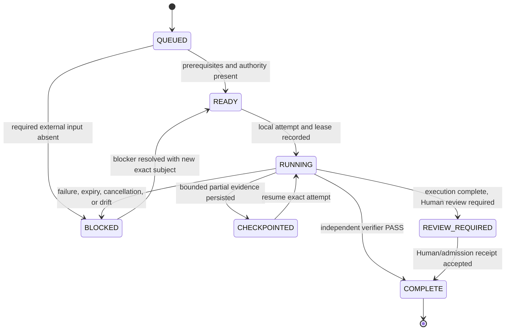

# Local Handoff Execution Queue

## Purpose

This queue is the zero-context continuation boundary for work that cannot be completed truthfully by a public/cloud Agent alone. It carries exact identities, commands, artifact expectations, and stop conditions to a local operator or Human authority without publishing secret values, private machine paths, protected source bytes, or unreviewed legal decisions.

Program: [#45](https://github.com/ed3c/website-design-compiler/issues/45)

## Reviewed subject

```yaml
repository: ed3c/website-design-compiler
canonical_main_sha: 4a79d9635911690950f02edda4505672ba7544f6
root_delivery_pr: 44
root_delivery_branch: codex/pr42-delivery-v2
root_delivery_head: 9e67222dea5580b1f807266162909422771da99e
integration_pr: 54
integration_branch: agent/shadow-architect-control-plane
integrated_code_head_before_document_refresh: c58958ee30e76d8aa9ad9388e6bf10adbd5a7db5
production_provider_issue: 25
program_issue: 45
```

Documentation commits after the integrated code head update the queue and indexes only. The local operator must fetch the latest branch and bind a new exact head before execution.

## Queue state model



Allowed public states:

`QUEUED | READY | RUNNING | CHECKPOINTED | REVIEW_REQUIRED | BLOCKED | COMPLETE`.

`COMPLETE` requires exact-subject artifacts and an independent verifier or named Human authority. A command being listed is not evidence that it ran.

## Queue summary

| ID | Owner | Current state | Primary issue(s) | Resume target |
|---|---|---|---|---|
| LHQ-001 | Human rights/provider owner | BLOCKED | #25 | protected production provider execution and rights receipt |
| LHQ-002 | Local Tech Lead / Git Town operator | REVIEW_REQUIRED | #49 | synchronize local topology and run active local carrier only if desired |
| LHQ-003 | Source owner + local parser reviewer | BLOCKED | #46, #63 | select/admit parser and produce real PDF observations |
| LHQ-004 | Google Workspace / CodeXdoc owner | BLOCKED | #50, #70, #73, #74, #75 | provider adapters and one-way write receipts |
| LHQ-005 | Product owner + architecture reviewer | NEEDS_INPUT | #51, #62, #76 | freeze evidence-bound 3D/video/audio decisions |
| LHQ-006 | Release owner | BLOCKED | #43, #44, #25 | exact-head PR #54/PR #44 verification, final main merge and release |
| LHQ-007 | Network/source security owner | QUEUED | #46, #72 | admitted URL acquisition adapter |
| LHQ-008 | Evidence-hardening worker + verifier | READY | #149 | self-verifying atomic edited-browser evidence package |

`NEEDS_INPUT` is shown for LHQ-005 because a product decision is missing; it is not a runtime queue state and must become `READY` or `BLOCKED` after the owner decides.

---

## LHQ-001 — Production provider, rights, and protected execution

```yaml
state: BLOCKED
owner: Human rights/provider owner
issues: [25]
subject: PR #44 exact future head plus exact provider/model/revision/request/output subjects
requires_secret_names:
  - WDC_PRODUCTION_REQUEST_SECRET
  - WDC_PRODUCTION_PROVIDER_CREDENTIAL
requires_protected_names:
  - WDC_PRODUCTION_PROVIDER_BUNDLE_BASE64
  - WDC_PRODUCTION_PROVIDER_BUNDLE_SHA256
  - WDC_PRODUCTION_RIGHTS_EVIDENCE_SHA256
  - WDC_PRODUCTION_CANDIDATE_TRUSTED_TREE
```

### Blocker

No public repository evidence can supply credential values, billing/quota consent, provider account authority, model/output/service terms acceptance, geographic/usage restrictions, or a Human legal decision.

### Prerequisites

- exact provider and model/revision identity;
- exact software/model/output/service/data-use rights subjects;
- approved Human admission with expiry and trusted byte hash;
- protected provider configuration bundle;
- bounded request, retry, timeout, rate, quota, and cost policy;
- exact Git subject that will consume the result.

### Local commands

```bash
git fetch --all --prune
git switch codex/pr42-delivery-v2
git pull --ff-only
pnpm install --frozen-lockfile
pnpm typecheck
pnpm build
pnpm test
pnpm rights:clearance
pnpm media:production-config
pnpm media:production-status
```

Provider execution must use the repository's protected configuration path and must not print credentials, raw provider error bodies, private paths, or unredacted endpoints.

### Expected artifacts

- canonical repository-rights receipt;
- signed Human/provider admission;
- exact provider execution receipt;
- validated asset bytes, MIME/extension/magic, dimensions/duration, and SHA-256;
- release-safe status receipt with no secret leakage;
- revocation record or explicit revocation lookup input.

### Negative controls

- non-ALLOW or semantically inconsistent rights stop before transport;
- expired/tampered/untrusted Human admission stops before transport;
- credentials never enter URLs, receipts, logs, or artifacts;
- timeout, cancellation, rate limit, quota, retry exhaustion, malformed bytes, MIME mismatch, and provider seed drift fail deterministically;
- deterministic mock `PASS` cannot satisfy production provider status.

### Completion gate

Independent verifier confirms exact provider/model/revision, rights subjects, admission digest, request, asset bytes, Git subject, and release profile. Issue #25 stays open until this gate passes.

### Resume target

PR #44 release evidence and LHQ-006.

---

## LHQ-002 — Local Git Town topology and active execution carrier

```yaml
state: REVIEW_REQUIRED
owner: Local Tech Lead / Git Town operator
issues: [49]
public_contracts_integrated: true
active_local_scheduler_exercised: false
```

### Current truth

Cloud/GitHub integration has already converged the molecular source/kernel, technology, control-plane, projection, and decision-contract stacks into PR #54. Git Town is therefore no longer required to perform those historical merges.

Local work remains useful for:

- checking branch reachability and stale local refs;
- pruning obsolete worktrees after Human review;
- running a private lease/scheduler carrier if the product actually needs one;
- reproducing exact commands with local protected inputs;
- preparing a conflict decision when PR #54 or PR #44 moves.

### Commands

```bash
git fetch --all --prune
git switch agent/shadow-architect-control-plane
git pull --ff-only
git branch --contains c58958ee30e76d8aa9ad9388e6bf10adbd5a7db5
git log --graph --decorate --oneline --all

# Optional, only when Git Town is installed and configured locally
git town status
git town config
```

Do not run `git town ship`, force-push, delete audit branches, rewrite reviewed SHAs, or auto-resolve conflicts without a new exact task packet.

### Expected artifacts

- local topology readback with exact branch heads;
- list of stale branches/worktrees proposed for Human-approved cleanup;
- if an active carrier is required: private attempt/lease/checkpoint/result records and a public-safe verifier receipt containing digests only.

### Completion gate

Local operator confirms topology and either:

1. records `NOT_REQUIRED` for an active scheduler; or
2. runs the admitted private carrier and produces an independent public-safe verification receipt.

### Resume target

Issue #49 parent disposition and LHQ-006.

---

## LHQ-003 — Real PDF parser and source-publication decision

```yaml
state: BLOCKED
owner: Source owner + local parser reviewer
issues: [46, 63]
current_boundary: DIGEST_ONLY / NOT_EXERCISED
planning_pdf_sha256: 7350f0e3d29ace70a6c92343e5501b34763f452e057d9b8acef3829f57230ef6
planning_pdf_byte_length: 1878749
```

### Blocker

The repository has a parser-neutral PDF request/receipt boundary but no admitted parser implementation for the planning PDF. Source bytes are intentionally not committed.

### Prerequisites

- source-owner permission for local parsing and any excerpt publication;
- exact parser package/version/distribution hash or Git commit/tree;
- technology admission and rights evidence;
- parser configuration and extraction-policy digest;
- page/range anchoring policy, byte/output bounds, timeout, cancellation, malformed/encrypted document handling;
- private local path supplied only to the local runner.

### Commands

Commands depend on the admitted parser. At minimum:

```bash
git fetch --all --prune
git switch agent/shadow-architect-control-plane
git pull --ff-only
pnpm install --frozen-lockfile
pnpm typecheck
pnpm build
pnpm test
```

The parser command must be added only after exact technology admission; do not substitute a remembered or floating package.

### Expected artifacts

- parser admission receipt;
- source manifest bound to exact input bytes;
- parse receipt with parser/config/policy identity;
- page/range observations with exact evidence digests;
- warnings and unsupported/encrypted state;
- public projection containing only permitted excerpts or hashes.

### Negative controls

- wrong PDF signature, byte/hash drift, parser/config/policy drift, oversized output, malformed pages, encryption, timeout, cancellation, traversal, and prohibited publication fail closed;
- parser output cannot silently become observed fact without page/range anchors;
- `NOT_EXERCISED` cannot be relabeled `PASS`.

### Completion gate

Independent verifier reproduces observation identities from the private exact bytes while confirming that public artifacts obey the publication decision.

### Resume target

Issue #46 source-plane parent and any article/PDF-derived implementation task.

---

## LHQ-004 — Google Docs, Google Sheets, and CodeXdoc projections

```yaml
state: BLOCKED
owner: Google Workspace / CodeXdoc owner
issues: [50, 70, 73, 74, 75]
local_export_foundation: PASS_AND_INTEGRATED
external_provider_adapters: NOT_IMPLEMENTED
```

### Blocker

The repository can deterministically produce local Markdown, CSV, and JSON projection bundles. It has no admitted provider adapters, OAuth consent, target document IDs, scopes, or exact write/readback receipts.

### Prerequisites

- Human decision on which projections are actually required;
- provider account and least-privilege scopes;
- target document/sheet IDs and access classification;
- exact adapter version/config/template identity;
- one-way write policy first; no silent external-to-Git mutation;
- retry, timeout, quota, idempotency, drift, and outage behavior.

### Expected artifacts

For each admitted provider:

- source export-bundle identity;
- target provider/document identity;
- request digest with no credential values;
- write result and provider revision/version;
- readback digest and drift state;
- failure receipt for permission, quota, timeout, conflict, or external edit.

### Completion gate

Independent verifier proves that provider output matches the exact local bundle and that provider outage does not block compiler build/test/release.

### Resume target

Close the corresponding provider child issue; update #50 parent state.

---

## LHQ-005 — Evidence-bound optional 3D, video, and audio decisions

```yaml
state: NEEDS_INPUT
owner: Product owner + architecture reviewer
issues: [51, 62, 76]
decision_contract: PASS_AND_INTEGRATED
human_product_decisions: ABSENT
implementation_eligible: false
```

### Required decision per track

- `THREE_D_PRODUCT_PHOTOSHOOT`
- `MOTION_VIDEO_EXPORT`
- `DJ_AUDIO_ENGINE`

Each must become exactly one of:

`ADOPT | DEFER | REJECT | SEPARATE_PRODUCT`.

### Prerequisites

- exact source/observation evidence anchors;
- measured product need and baseline gap;
- prerequisites and blocking issue IDs;
- semantic/static fallback requirements;
- dependency/provider/Human admission flags;
- target product for `SEPARATE_PRODUCT`;
- explicit implementation start condition.

### Negative controls

- synthetic fixtures do not count as Human decisions;
- `ADOPT` cannot start implementation until every named issue gate is satisfied;
- `DEFER` and `REJECT` never open an implementation DAG;
- `SEPARATE_PRODUCT` cannot target `website-design-compiler`;
- no package, provider, GPU, codec, model, audio, video, or 3D dependency is added from the decision contract alone.

### Completion gate

Human product owner signs exact decision packets; independent architecture reviewer verifies evidence and product boundary. Only an `ADOPT` packet with all gates satisfied may create a new implementation DAG.

### Resume target

Issue #76 convergence or a separate-product repository program.

---

## LHQ-006 — Exact-head integration, root delivery, main merge, and release

```yaml
state: BLOCKED
owner: Release owner
issues: [43, 44, 25]
integration_pr: 54
root_delivery_pr: 44
main_merge_allowed: false
```

### Prerequisites

1. Fetch the latest PR #54 head after documentation updates.
2. Verify typecheck, build, unit tests, compiler stages, UI build, browser lanes, authoring, CMS, rights, and release receipts.
3. Confirm any aggregate failure is limited to explicitly missing Human-controlled admissions; implementation regressions must be fixed first.
4. Merge PR #54 only into PR #44's branch with expected-head protection.
5. Re-run PR #44 on its new exact head.
6. Satisfy issue #25 and all trusted visual/Storybook/rights/provider/release admissions.
7. Obtain authorized final review and merge decision.

### Commands

```bash
git fetch --all --prune
git switch agent/shadow-architect-control-plane
git pull --ff-only
pnpm install --frozen-lockfile
pnpm typecheck
pnpm build
pnpm test
pnpm ui:typecheck
pnpm ui:build
pnpm browser:typecheck
pnpm storybook:typecheck
pnpm arena:typecheck
```

Use GitHub Actions for the full browser/release workflow and preserve exact artifacts.

### Stop conditions

Stop and keep `BLOCKED` if:

- any implementation/build/test/browser step fails;
- branch head changes after verification;
- a required child receipt is missing, stale, malformed, or bound to another SHA/ref;
- rights/provider/visual/Storybook admission is absent;
- release evidence is reconstructed from fixtures or a synthetic PR merge ref;
- any credential, private path, or protected source byte appears in public output.

### Completion gate

PR #44 exact head passes the canonical release profile with all Human/provider admissions, then an authorized owner merges it to `main` and verifies the resulting canonical main SHA.

### Resume target

Close #43 and the completed program parent only after canonical main readback. Issue #25 closes only with its own provider/rights acceptance.

---

## LHQ-007 — Admitted URL acquisition adapter

```yaml
state: QUEUED
owner: Network/source security owner
issues: [46, 72]
implementation: NOT_IMPLEMENTED
```

### Required behavior

Create an exact URL-capture adapter that reuses the repository's public-target policy and source manifest/observation contracts without leaking credentials, queries, private addresses, DNS details, or raw transport errors.

### Prerequisites

- exact task packet and disjoint writeset;
- allowed schemes/media types, byte bounds, redirect count, timeout, retry, DNS and connected-peer policy;
- publication classification and excerpt bounds;
- deterministic injected transport fixtures plus a separately admitted live transport test;
- no provider credential use.

### Negative controls

- loopback, private, link-local, metadata, mapped/embedded private addresses;
- DNS rebinding and redirect-to-private;
- credential/query-bearing public locators;
- peer mismatch, oversized body, unsupported media, invalid UTF-8, timeout, cancellation, and raw error leakage.

### Completion gate

Exact-head tests and independent verifier prove source identity, redirect lineage, bounded bytes, anchored observations, and public-safe receipts. Cloud fixtures must not be relabeled as unrestricted internet proof.

### Resume target

Issue #72, then parent #46.

---

## LHQ-008 — Atomic, self-verifying edited-browser evidence package

```yaml
state: READY
owner: Evidence-hardening worker + independent verifier
issues: [149]
base_evidence: PR #148 exact browser proof
provider_or_human_admission_required: false
```

### Required behavior

- versioned durable manifest schema;
- receipt identity recomputation;
- per-observation path, byte length, and SHA-256;
- full observation-to-receipt field comparison;
- project-owned path enforcement;
- traversal, symlink, duplicate/missing project, stale extra, and partial-write refusal;
- temporary directory plus atomic durable replacement;
- standalone verifier over an uploaded artifact;
- deterministic negative tests.

### Suggested writeset

```text
scripts/persist-kernel-edited-page-browser-artifacts.ts
scripts/verify-kernel-edited-page-browser-artifacts.ts
schemas/kernel-edited-page-browser-artifact-manifest.schema.json
tests/kernel-edited-page-browser-artifacts.test.ts
README.md or docs/architecture/STACKED_PR_INDEX.md only through the named convergence/doc owner
```

### Completion gate

One manifest digest transitively binds the exact receipt, four observations, and four screenshots. Every required mutation fails without leaving a partially promoted durable directory. A standalone verifier reproduces `PASS` from uploaded bytes only.

### Resume target

Close #149 and update the Shadow monitor with the new exact head/artifact digest.

---

## Handoff packet template

Every local continuation must publish a public-safe packet using this shape:

```yaml
queue_id: LHQ-XXX
program_id: wdc-architecture-program-45
subject:
  repository: ed3c/website-design-compiler
  base_ref: <ref>
  base_sha: <sha>
  head_ref: <ref>
  head_sha: <sha>
owner: <role>
attempt_id: <id>
lease_id: <id-or-NOT_APPLICABLE>
state: <queue-state>
prerequisites: []
allowed_writeset: []
excluded_paths: []
commands: []
required_secret_names: []
required_hardware_names: []
produced_artifacts:
  - path: <public-safe-path>
    sha256: <digest>
negative_controls: []
verification_owner: <different-role-or-Human-authority>
completion_gate: <exact condition>
open_findings: []
resume_target: <issue/pr/queue-id>
```

Never include secret values, private machine paths, protected source bytes, provider tokens, legal conclusions inferred by an Agent, or unredacted transport errors.
