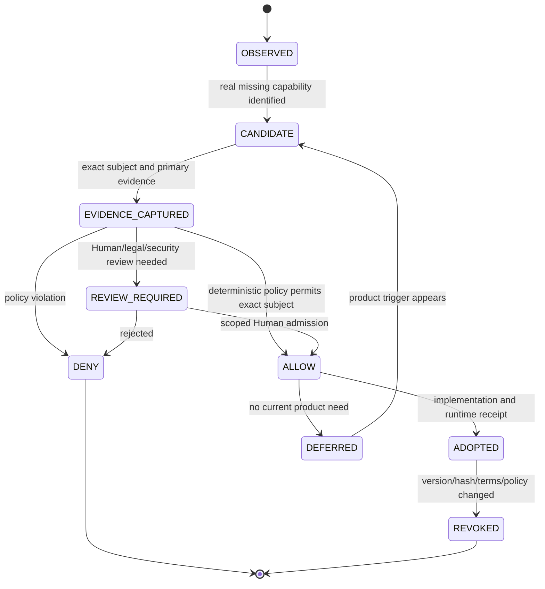
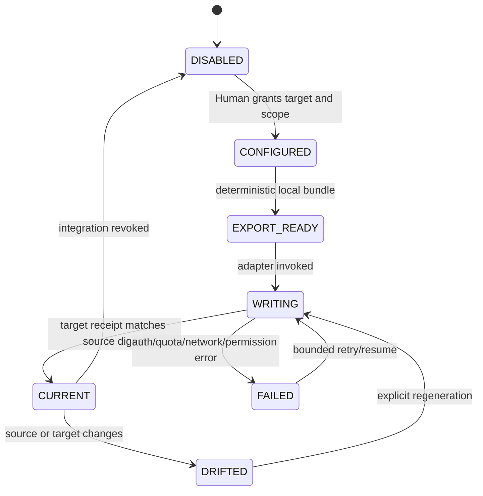

# Source and Technology Registry

## Purpose

This document defines how architecture sources, external URLs, repositories, packages, models, providers and document systems enter `website-design-compiler`.

It is a policy and routing specification. It does not admit a dependency or prove a license/model/provider right by naming it.

Program: [#45](https://github.com/ed3c/website-design-compiler/issues/45)

Owning issues:

- source plane — [#46](https://github.com/ed3c/website-design-compiler/issues/46)
- compiler patch/constraint kernel — [#47](https://github.com/ed3c/website-design-compiler/issues/47)
- technology admission — [#48](https://github.com/ed3c/website-design-compiler/issues/48)
- projection plane — [#50](https://github.com/ed3c/website-design-compiler/issues/50)
- optional product tracks — [#51](https://github.com/ed3c/website-design-compiler/issues/51)
- production provider rights/execution — [#25](https://github.com/ed3c/website-design-compiler/issues/25)

## Canonical truth hierarchy

| Rank | Surface | Authority |
|---:|---|---|
| 1 | exact Git commit plus machine-readable repository artifacts | canonical code, schema, policy, manifest and receipt |
| 2 | GitHub issues and pull requests | canonical work, dependency, review and delivery ledger |
| 3 | exact `skills-shared` binding | canonical shared procedure identity; body stays private |
| 4 | Google Docs/Sheets/CodeXdoc projection | human-readable derived view with source digest and drift state |
| 5 | local/private carrier | secret-bearing execution, private bytes, active leases and hardware state; not public truth until a safe receipt is published |

An external document title or URL is not a canonical architecture identity without a source digest and projection receipt.

## Source classes

```text
ARTICLE
PDF
URL
GIT_REPOSITORY
GIT_PATH
PACKAGE_DISTRIBUTION
MODEL_WEIGHTS
HOSTED_PROVIDER
FONT
IMAGE
VIDEO
AUDIO
DATASET
PROMPT
DOCUMENT_PROJECTION
OTHER
```

## Source manifest contract

```json
{
  "schema": "website-design-compiler/source-manifest/v1",
  "sourceId": "stable-id",
  "sourceClass": "PDF",
  "locator": {
    "kind": "user-provided-attachment",
    "value": "public-safe-reference"
  },
  "accessClassification": "USER_PROVIDED",
  "publicationClassification": "DIGEST_ONLY",
  "contentIdentity": {
    "mediaType": "application/pdf",
    "byteLength": 0,
    "sha256": "hex"
  },
  "gitIdentity": null,
  "observer": {
    "name": "parser-or-capture-adapter",
    "version": "exact",
    "configurationDigest": "sha256"
  },
  "anchors": [],
  "extractionWarnings": [],
  "capturedAt": "RFC3339",
  "supersedes": null
}
```

For a Git source, use exact repository, commit, tree and path/range identity instead of byte-only identity.

### Observation contract

```json
{
  "schema": "website-design-compiler/source-observation/v1",
  "sourceManifestDigest": "sha256",
  "observationId": "stable-id",
  "anchor": {
    "page": 1,
    "startLine": 1,
    "endLine": 2,
    "path": null
  },
  "kind": "OBSERVED_FACT",
  "statement": "bounded paraphrase",
  "confidence": "DIRECT|DERIVED|UNCERTAIN",
  "inference": null,
  "publicationState": "ALLOWED"
}
```

Inference and recommendation use separate `kind` values and must name their supporting observations.

## Registered source for this program

```yaml
source_id: modern-web-design-architecture-extension-2026-08-18
title: 現代網頁設計架構擴充建議
source_class: PDF
media_type: application/pdf
byte_length: 1878749
sha256: 7350f0e3d29ace70a6c92343e5501b34763f452e057d9b8acef3829f57230ef6
locator: user-provided attachment
public_bytes_committed: false
publication: DIGEST_AND_ANCHORS_ONLY
planning_parser_state: CONVERSATION_PARSED_NOT_REPOSITORY_RUNTIME
reviewed_sections:
  - pages 1-2: architecture thesis and product mappings
  - pages 2-17: 3D product photography pipeline examples
  - pages 7-9: initial technology candidates
  - pages 18-27: DJ/audio architecture examples
  - pages 27-34: broader candidates, package list and license-check CI sketch
admission:
  architecture_thesis: HYPOTHESIS
  product_equivalence_claims: NOT_VERIFIED
  code_samples: ILLUSTRATIVE
  performance_and_cost_claims: NOT_VERIFIED
  license_and_commercial_safety_claims: NOT_ADMITTED
```

The attached byte identity is now frozen for planning. Issue #46 must still produce a repository-runtime manifest that binds the exact parser/version, extraction warnings, page anchors and publication decision; the planning review is not that runtime receipt.

## Repository roles

### Required

| Repository | Role | Boundary |
|---|---|---|
| `ed3c/website-design-compiler` | product compiler and canonical product routing center | product contracts, issues, PRs, source/tech identities, receipts and handoffs |
| `ed3c/skills-shared` | canonical shared procedure provider | exact binding only; private skill bodies never copied into this public repository |

### Optional adapters

| Repository/system | Possible role | Admission |
|---|---|---|
| `ed3c/bettor-arena` | evaluator/tournament patterns for candidate designs or implementations | explicit adapter/eval issue; not required for first closure wave |
| local Forgejo | private implementation plane | only through `dual-forge-repository-loop` with exact cross-forge receipts |
| Google Docs | architecture/review narrative projection | #50, one-way and digest-bound first |
| Google Sheets | registry/DAG/status/queue projection | #50, one-way and digest-bound first |
| CodeXdoc | optional documentation projection or research input | #50, never required for build/release |

Do not use another repository as a hidden source of product truth. Cross-repository data requires exact commit/artifact identity and an explicit adapter.

## Technology candidate lifecycle



A package name, repository URL or model family is not enough to reach `ALLOW`.

### Technology candidate record

```yaml
candidate_id: <stable-id>
capability_issue: <number>
capability_gap:
  current_behavior: <measured>
  required_behavior: <falsifiable>
  current_repository_alternative: <tested-result>
subject:
  kind: <PACKAGE|REPOSITORY|MODEL|PROVIDER|ASSET|FONT|CODEC>
  name: <exact>
  version_or_revision: <exact>
  source_or_registry: <locator>
  distribution_sha256: <hash-or-ABSENT>
  repository_commit: <sha-or-ABSENT>
runtime_role: <client|server|build|dev|worker|model|service>
optional: true
rights_subjects:
  software_license: <separate-id>
  model_weights: <separate-id-or-NOT_APPLICABLE>
  generated_output: <separate-id-or-NOT_APPLICABLE>
  hosted_service: <separate-id-or-NOT_APPLICABLE>
  data_use: <separate-id-or-NOT_APPLICABLE>
  asset_font_media: <separate-id-or-NOT_APPLICABLE>
security_and_data_boundary: <summary>
transitive_subjects: []
notice_requirements: []
positive_fixtures: []
negative_controls: []
fallback_and_removal: <contract>
admission_state: <UNKNOWN|REVIEW|ALLOW|DENY|REVOKED>
admission_receipt: <path-or-ABSENT>
```

## Rights subjects are separate

Do not collapse these:

```text
software package license
repository source license
model-weight license
model card/use restrictions
generated-output ownership/use terms
hosted-service terms
API data retention/training terms
font license
image/video/audio/3D asset license
codec/patent considerations
third-party notice/attribution requirements
```

A permissive JavaScript client does not admit a model or hosted service. A permissive model runner does not admit model weights or output terms. A repository LICENSE file does not automatically bind every release artifact, vendored binary, dataset, font or media asset.

## SPDX and policy

The policy engine must parse expressions rather than scan substrings.

Examples:

```text
MIT OR Apache-2.0
(Apache-2.0 AND BSD-3-Clause)
GPL-2.0-only WITH Classpath-exception-2.0
LicenseRef-Proprietary
SEE LICENSE IN LICENSE.txt
```

Required behavior:

- preserve `AND`, `OR` and `WITH` semantics;
- distinguish SPDX ID from custom/unknown metadata;
- bind expression to exact package distribution/source bytes;
- record license-text hash and notices;
- handle dual-license choice explicitly;
- fail closed on absent, ambiguous or changed product-core subjects;
- support scoped Human review without claiming legal certainty;
- produce revocation when version/hash/terms change.

A broad whitelist of strings or blacklist regex is not sufficient for #48 closure.

## Current repository capabilities to prefer

Before adding candidates, inspect and reuse:

| Capability | Existing foundation |
|---|---|
| schemas and validation | TypeScript, Ajv, JSON/YAML contracts and receipt scripts |
| product compiler | brief, IA, content, visual, token, section, responsive, page graph, motion/media passes |
| authoring/CMS | governed Puck projection, Payload persistence and round-trip tests |
| runtime UI | Next.js/React application and generated benchmark pages |
| browser verification | Playwright, Storybook, generated-page and runtime evidence |
| design evaluation | deterministic calibrated design-quality evaluation and Arena metrics |
| reference capture | URL/network security, browser/media observation and provenance |
| graphics | existing Three/R3F/WebGPU/WebGL/static fallback paths |
| rights/release | repository rights clearance, provider admission seam, v1/v2 release profiles |
| shared orchestration methods | exact bindings to `skills-shared` |

A candidate must beat or fill a measured gap in this foundation.

## Candidate families from the source PDF

The following table records source-reported candidates, not admitted dependencies.

| Family | Source-reported candidates | Default disposition |
|---|---|---|
| browser CV | `onnxruntime-web`, `earcut`, `potrace`, `glfx.js` | `DEFERRED`; trigger through #51 or measured source-plane need |
| 3D/physics | Three/R3F, Rapier, `three-mesh-bvh`, Troika, postprocessing | existing Three/R3F paths; additional packages require #48 and #51 |
| layout/text | Yoga, `opentype.js`, HarfBuzz, `bidi-js`, polygon/SVG tools | `CANDIDATE` only for a failing #47 constraint/text case |
| collaboration/history | Yjs, zundo, Dexie | `DEFERRED` until concurrent/offline editing is a product requirement |
| audio/DJ | Essentia.js, wavesurfer, Tone, WebMIDI, VAD, resamplers | `OUT_OF_SCOPE` for core; #51 separate-product decision |
| video/export | WebCodecs, MP4/WebM muxers, GIF encoders, media metadata | `DEFERRED`; adopt only for explicit export product contract |
| asset transfer | fflate, S3/R2 presigning | use only after measured asset-size/throughput requirement |
| vector search | LanceDB/HNSW | `DEFERRED`; requires retrieval eval and data deletion/privacy contract |
| queue/orchestration | BullMQ, pg-boss | do not add for planning; trigger only when render jobs need durable distributed execution |
| auth/RBAC | Better Auth, CASL | adopt only when the product’s existing auth boundary is insufficient |
| telemetry | detect-gpu, web-vitals | compare with existing browser/capability/performance evidence first |
| generative runtime | vLLM, Diffusers, hosted GPU providers | #25 Human/provider admission; never a baseline dependency by source analogy |

The PDF-reported license labels are not admission. Exact current release bytes, expressions, transitive subjects and service/model terms must be collected under #48/#25.

## Selection rules by capability

### Source plane

Potential parser choices must be benchmarked on the actual source classes. Do not select a PDF library solely by popularity.

Evaluate:

- browser/Node compatibility;
- page text and layout anchor fidelity;
- image/table/embedded-object handling;
- malformed/encrypted/large-file behavior;
- deterministic output across supported environments;
- memory/time/resource bounds;
- exact license and transitive/build subjects;
- ability to keep private bytes local.

A simple internal adapter with a narrow parser may be preferable to a large dependency if the accepted source scope is small.

### Constraint and bidirectional authoring

Start with typed deterministic patch operations and current compiler passes.

Adopt a new solver/layout/CRDT/history technology only after:

- a failing deterministic fixture proves the gap;
- semantic identity and conflict behavior are specified;
- hard/soft constraint precedence is explicit;
- timeout/non-convergence/cleanup/fallback exists;
- cross-client determinism and migration are understood;
- exact #48 admission passes.

### 3D/CV/video/audio

These are capability tracks, not general utilities.

Required before adoption:

- issue #51 `ADOPT` decision;
- explicit user/business problem and release profile;
- semantic DOM/static fallback ownership;
- device/browser/performance matrix;
- exact package/model/provider admission;
- privacy/data/copyright/output/service terms;
- teardown and resource disposal;
- deterministic proof-of-contract before live provider/hardware execution.

### Queue/storage/auth

Do not add infrastructure to solve a planning problem.

A queue requires durable job semantics, retries, idempotency, cancellation, retention, observability and operating ownership. Storage requires deletion/export/privacy/migration. Auth/RBAC requires tenant and policy contracts. These capabilities need separate design tasks and are not implied by the source PDF.

## Document routing

### GitHub

Use GitHub issues and PRs for:

- program and workstream identity;
- dependency and blocker relationships;
- task/branch/PR/receipt traceability;
- review and Human admission status;
- canonical links to repository artifacts.

Do not store secret values, private paths or unpublished source bytes in issue bodies/comments.

### Google Docs

Use for:

- architecture narrative;
- review packet;
- decision record projection;
- stakeholder-readable phase prompt pack.

Required projection metadata:

```yaml
source_artifacts: []
source_digest: <sha256>
target_document_id: <id>
template_version: <version>
access_classification: <class>
write_state: <PASS|FAIL|NOT_EXERCISED>
drift_state: <CURRENT|DRIFTED|UNKNOWN>
```

### Google Sheets

Use for:

- source and technology registry view;
- issue/DAG/status dashboard;
- evidence-state matrix;
- owner/blocker view;
- Local Handoff Queue view.

Every row must retain canonical GitHub/artifact IDs and source digests. A sheet cell is not the source of truth.

### CodeXdoc

Treat CodeXdoc as optional unless an exact API/export contract is admitted.

Permitted roles:

- read-only research/documentation input;
- generated documentation projection;
- human browsing layer.

Forbidden role:

- required build/plan/release dependency;
- canonical issue/evidence state;
- implicit two-way mutation of code or architecture;
- evidence promotion from generated prose.

## Projection lifecycle



Projection failure remains non-blocking for core release.

## URL registry rules

Store stable public-safe URLs only when they route to a canonical or approved projection subject:

```yaml
url_id: <stable-id>
kind: <GITHUB_REPOSITORY|GITHUB_ISSUE|GITHUB_PR|GITHUB_ARTIFACT|GOOGLE_DOC|GOOGLE_SHEET|CODEXDOC|SOURCE_URL>
url: <url>
subject_identity: <commit/issue/pr/document/source digest>
access_classification: <PUBLIC|PRIVATE|PROTECTED>
owner: <role>
last_verified: <timestamp>
state: <CURRENT|DRIFTED|UNAVAILABLE|UNKNOWN>
```

Do not put signed URLs, tokens, local paths, ephemeral download URLs or credential-bearing query parameters in the registry.

## Admission checklist

Before an external technology enters a product branch:

- [ ] capability issue exists;
- [ ] current repository alternative was tested;
- [ ] exact subject version/commit/revision/hash is pinned;
- [ ] primary license/terms evidence is captured;
- [ ] software/model/output/service/data/asset rights are separated;
- [ ] transitive/SBOM impact is known;
- [ ] security and resource boundary is explicit;
- [ ] deterministic positive and negative fixtures exist;
- [ ] fallback/removal path exists;
- [ ] exact admission receipt is `ALLOW`;
- [ ] Stack PR and release profile are defined;
- [ ] required Human admission is recorded without secret values.

Until then the candidate remains `CANDIDATE`, `DEFERRED`, `UNKNOWN`, `DENIED` or `OUT_OF_SCOPE`.
