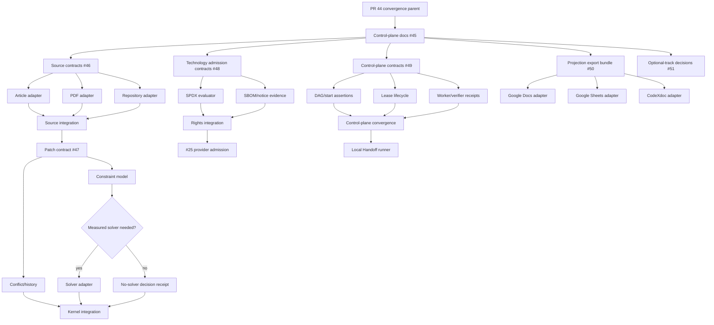

# Stacked PR Index

## Purpose

This index is the public delivery map for program [#45](https://github.com/ed3c/website-design-compiler/issues/45).

It distinguishes:

- **true stacks** — child behavior cannot be reviewed or run without the parent behavior;
- **parallel independent stacks** — leaves share a program but have no code dependency;
- **convergence work** — shared files or semantics have one integration owner;
- **Human/local admission** — no branch can manufacture the missing authority.

Branch names below are planned unless a PR/commit is explicitly recorded.

## Rules

1. One independently reviewable behavior per branch.
2. A child PR targets its real parent branch, not automatically `main`.
3. Independent leaves do not become a fake linear stack.
4. Shared files have one convergence owner.
5. Every PR body records:
   - program/issue/task;
   - parent branch and PR;
   - exact base/head SHA;
   - writeset and excluded paths;
   - commands and negative controls;
   - artifacts and evidence state;
   - local/Human blockers.
6. Worker, verifier, convergence and Stack PR roles remain distinct.
7. Merge oldest-first.
8. Automatic merge and automatic conflict resolution are disabled.
9. Parent movement invalidates child head receipts until synchronized and reverified.
10. Active local leases/worktrees and secret values are not published.

## Active root stack

```text
refs/heads/main
  4a79d9635911690950f02edda4505672ba7544f6
    |
    `-- PR #44: codex/pr42-delivery-v2
          9e67222dea5580b1f807266162909422771da99e
            |
            `-- agent/shadow-architect-control-plane
                  initial PR: PENDING
                  program: #45
```

The control-plane documentation branch is a child of PR #44 because it describes and routes the exact convergence branch state. It must not be rebased onto another subject without updating every exact identity and rerunning review.

## Wave map



The fan-out branches after A1/C1/D1/E1 are independent stacks based on an accepted contract branch or its merged result. They may run in parallel. A convergence branch starts only after all required predecessors are independently verified.

## Stack A — Source plane (#46)

### A1 foundation

| Stack ID | Branch | Parent | Purpose |
|---|---|---|---|
| A1 | `feat/source-manifest-contracts` | S1 control-plane docs | source manifest, observation, publication and drift schemas/fixtures |

### Parallel adapter stacks

| Stack ID | Branch | Parent | Purpose | Writeset ownership |
|---|---|---|---|---|
| A2 | `feat/source-adapter-article` | accepted A1 subject | article byte/parser/anchor adapter | article adapter, fixtures/tests only |
| A3 | `feat/source-adapter-pdf` | accepted A1 subject | PDF byte/parser/page-anchor adapter | PDF adapter, fixtures/tests only |
| A4 | `feat/source-adapter-repository` | accepted A1 subject | exact repo/commit/tree/path adapter | repository adapter, fixtures/tests only |

### A5 convergence

| Stack ID | Branch | Parents | Purpose |
|---|---|---|---|
| A5 | `feat/source-plane-convergence` | verified A2 + A3 + A4 | shared manifest factory, CLI/receipts and cross-adapter tests |

Only A5 edits shared source registry/CLI/convergence files.

## Stack B — Patch and constraint kernel (#47)

Starts only after A5 source-plane convergence is accepted.

| Stack ID | Branch | Parent | Purpose |
|---|---|---|---|
| B1 | `feat/page-graph-patch-contracts` | A5 accepted subject | typed patch operations, node/base identity and refusal states |
| B2 | `feat/page-graph-conflict-history` | B1 | stale/conflict handling and provenance-preserving reversible history |
| B3 | `feat/constraint-model` | B1 | hard/soft constraints, satisfaction and unresolved-violation receipts |
| B4 | `feat/solver-decision` | B3 | measured decision whether deterministic passes are sufficient |
| B5 | `feat/bounded-solver-adapter` | B4 = solver required | adapter identity/config/timeout/non-convergence/fallback |
| B6 | `docs/no-solver-sufficiency` | B4 = solver unnecessary | falsifiable no-solver decision receipt |
| B7 | `feat/compiler-kernel-convergence` | B2 + B5 or B6 | Puck/Payload/page-graph/browser integration |

B5 and B6 are mutually exclusive decision outcomes, not parallel implementations to merge together.

## Stack C — Technology admission (#48)

Independent from source adapter implementation after S1.

| Stack ID | Branch | Parent | Purpose |
|---|---|---|---|
| C1 | `feat/technology-admission-contracts` | S1 | candidate, rights-subject, admission and revocation schemas/fixtures |
| C2 | `feat/spdx-expression-evaluator` | C1 | expression-aware policy and negative fixtures |
| C3 | `feat/sbom-notice-evidence` | C1 | exact lockfile/package/bundle subject and notice candidates |
| C4 | `feat/rights-subject-convergence` | C2 + C3 accepted | canonical repository/model/provider rights subject bridge |

C2 and C3 may run as independent sibling stacks after C1 is accepted. C4 starts after both are verified.

C4 does not make legal decisions and does not close #25. It gives #25 one canonical rights subject graph.

## Stack D — Executable control plane (#49)

Independent product-control stack.

| Stack ID | Branch | Parent | Purpose |
|---|---|---|---|
| D1 | `feat/control-plane-contracts` | S1 | program/task/DAG/lease/result/verifier/handoff schemas |
| D2 | `feat/control-plane-dag-admission` | D1 | true dependency and start-eligibility assertions |
| D3 | `feat/control-plane-lease-lifecycle` | D1 | attempt/lease/checkpoint/result terminal separation |
| D4 | `feat/control-plane-worker-verifier` | D1 | worker and independent verifier receipt assertions |
| D5 | `feat/control-plane-convergence` | D2 + D3 + D4 accepted | writeset collisions, convergence ownership, global objective retention |
| D6 | `feat/local-handoff-queue` | D5 | zero-context local queue compiler and public-safe issue summary |

D2–D4 are parallel sibling stacks after D1. D5 has one integration owner.

## Stack E — Projection plane (#50)

Optional and never a core release dependency.

| Stack ID | Branch | Parent | Purpose |
|---|---|---|---|
| E1 | `feat/projection-export-bundle` | S1 | local deterministic Markdown/CSV/JSON bundle and projection receipt |
| E2 | `feat/google-docs-projection` | E1 | one-way digest-bound Docs write adapter |
| E3 | `feat/google-sheets-projection` | E1 | one-way registry/dashboard write adapter |
| E4 | `feat/codexdoc-projection` | E1 | optional hosted documentation adapter |

E2–E4 are independent and may be accepted, deferred or rejected separately. External outages remain non-blocking.

## Stack F — Optional product tracks (#51)

Decision packets precede implementation.

| Track | Decision branch | Allowed result |
|---|---|---|
| 3D product photoshoot | `docs/decision-3d-photoshoot` | `ADOPT | DEFER | REJECT | SEPARATE_PRODUCT` |
| motion/video composition | `docs/decision-video-composition` | `ADOPT | DEFER | REJECT | SEPARATE_PRODUCT` |
| DJ/audio DSP | `docs/decision-dj-audio` | `ADOPT | DEFER | REJECT | SEPARATE_PRODUCT` |

Default expectation:

- 3D photoshoot — `DEFER` until a product requirement and #25/#48 admission exist;
- motion/video composition — `DEFER` or a separate capability profile;
- DJ/audio — `SEPARATE_PRODUCT` unless the product scope changes.

An `ADOPT` decision creates a new issue DAG and Stack PR index. It does not reuse the decision branch as an implementation mega-branch.

## Production/Human stack (#25)

Issue #25 is not a normal autonomous stack.

Current mechanical parent:

- PR #44 preserves fail-closed rights/provider artifacts and must remain unmerged while required gates fail.

Remaining ordered admission:

1. exact distributed dependency/bundle subjects receive scoped decisions;
2. protected rights digest and trusted tree bind the reviewed snapshot;
3. one exact image provider/model has software/model/output/service subjects `ALLOW`;
4. protected provider bundle, signing secret, credential, budget/quota and trusted authority are provisioned;
5. exact canonical `main` push executes and persists provider request ID, generated asset/provenance, status and commercial release receipt.

Branch names are not pre-created for steps that depend on Human decisions or secret-bearing configuration. The Local Handoff Queue owns continuation.

## PR body template

```markdown
Part of #<program-or-issue>
Parent PR: #<number or none>
Parent branch: `<branch>`
Task: `<task-id>`

## Exact subject
- base SHA: `<sha>`
- head SHA: `<sha>`
- source manifest digest: `<sha256>`
- task contract digest: `<sha256>`

## Atomic behavior
<one behavior>

## Writeset
- `<glob>`

## Excluded paths
- `<glob>`

## Verification
- `<command>` — `<state>`
- negative: `<command>` — `<state>`

## Artifacts
- `<path>` — `<sha256>`

## Evidence boundary
- runtime state: `<state>`
- Human/local state: `<state>`
- unresolved findings: ...

## Stack
`parent -> current -> child/planned`

## Safety
- no secret values
- no private skill bodies
- no automatic merge
- no automatic conflict resolution
```

## Git Town local sequence

Git Town is not currently a repository-proven installed capability. The local operator first completes queue item `LHQ-002`.

Representative sequence after local admission:

```bash
git fetch --all --prune
git switch codex/pr42-delivery-v2
git pull --ff-only
git town init
git town append agent/shadow-architect-control-plane
git town propose --draft
git town sync --stack
git town branch
```

Exact commands must be checked against the installed Git Town version and repository configuration. Secret/token values never enter committed configuration.

## Merge order

1. PR #44 only after its required gates and Human decisions permit.
2. S1 control-plane documentation.
3. Contract foundations A1, C1, D1 and E1 in any order after S1, subject to review capacity.
4. Independent leaves within each accepted foundation.
5. Convergence branch for each workstream.
6. Cross-workstream integration only when a true dependency exists.
7. Optional projection/product tracks independently.
8. Production provider only through #25 Human/local sequence.

After any parent merge, remaining children must be synchronized and reverified. Previous head receipts become stale if the head changes.

## Traceability requirements

Every stack entry must remain traceable through:

```text
source manifest
  -> architecture finding
  -> issue
  -> task packet
  -> attempt + lease
  -> branch + commits
  -> worker result
  -> independent verifier
  -> convergence decision
  -> PR
  -> canonical main receipt or Local Handoff Queue
```

Missing any required link blocks closure.
