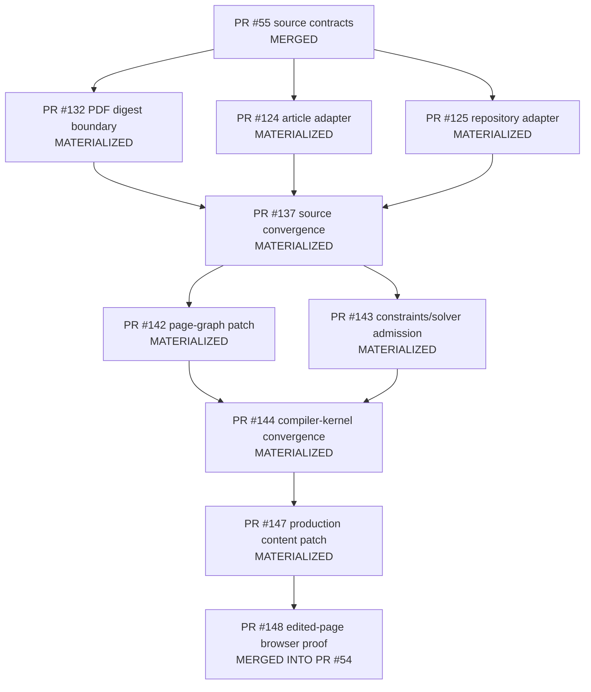
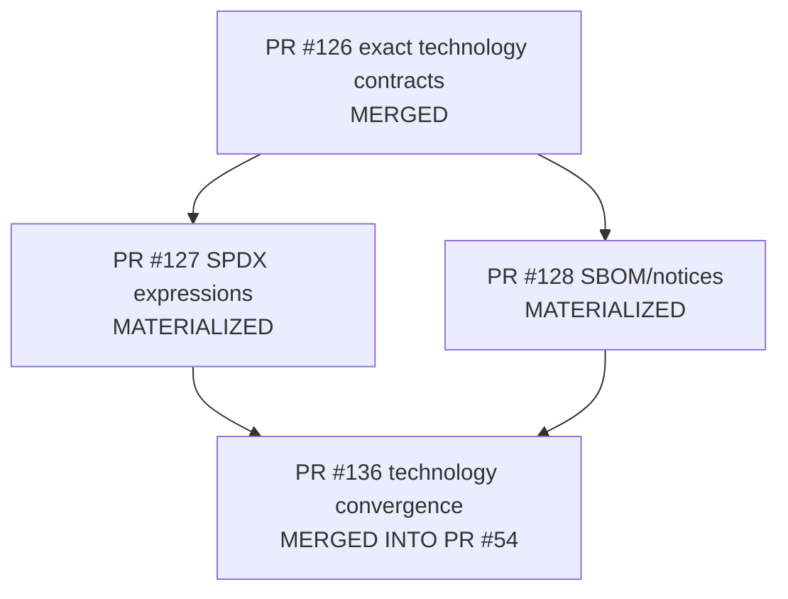
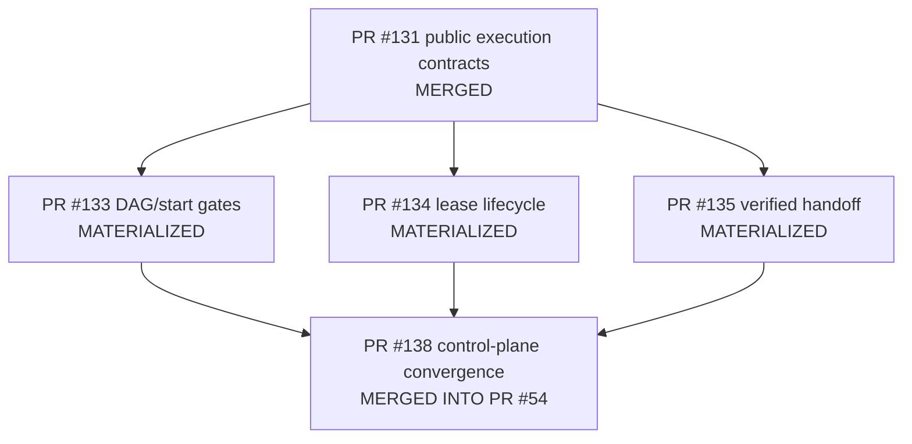

# Stacked PR Index

## Purpose

This file is the canonical public delivery map for program [#45](https://github.com/ed3c/website-design-compiler/issues/45). It records actual branch ancestry, exact reviewed heads, convergence carriers, materialized molecular leaves, and the remaining path to `main`.

The index is descriptive evidence, not merge authority. Git Town may reproduce the topology locally, but Git ancestry, exact SHAs, PR state, CI receipts, and Human release decisions remain authoritative.

## Evidence terms

- **MERGED** — GitHub records the PR as merged into its declared base.
- **MATERIALIZED** — the exact leaf commits are reachable through a later convergence carrier; the leaf PR is closed without a separate merge.
- **INTEGRATED** — the convergence carrier is reachable from PR #54's branch.
- **BLOCKED** — a required Human/local/provider/release gate is absent.

A materialized leaf is not discarded. Its PR body, exact head, tests, negative controls, and review history remain the molecular trace.

## Current delivery spine

```text
main@4a79d9635911690950f02edda4505672ba7544f6
└── codex/pr42-delivery-v2@9e67222dea5580b1f807266162909422771da99e   PR #44 [OPEN, DRAFT, MAIN MERGE BLOCKED]
    └── agent/shadow-architect-control-plane                               PR #54 [OPEN, DRAFT, INTERNAL INTEGRATION]
        ├── source + compiler-kernel carrier                              PR #148 [MERGED]
        ├── technology-governance carrier                                PR #136 [MERGED]
        ├── executable control-plane carrier                             PR #138 [MERGED]
        ├── local projection foundation                                  PR #129 [MERGED]
        └── optional-decision contract                                   PR #130 [MERGED, CONTRACT ONLY]
```

Reviewed code convergence head before documentation refresh:

```text
agent/shadow-architect-control-plane@c58958ee30e76d8aa9ad9388e6bf10adbd5a7db5
```

Documentation commits after that head update routing truth only. Any later implementation change requires a new exact-head verification.

## Integration order

| Order | Carrier PR | Exact verified head | Internal merge commit on PR #54 branch | Scope |
|---:|---:|---|---|---|
| 1 | #148 | `b1b5da6d8d8e71a87de8cb1fbeb32a93fd69e880` | `ace73bc7b9eba7c460c3489a18ccd4b0ba1fc6a0` | source plane, patch/constraint kernel, production content patch, exact edited-page browser proof |
| 2 | #136 | `1a1a8307f053d89fa55424f560f5ac8840578513` | `13711eb0e3adad1479cc059252fbea55a208b650` | exact technology identities, SPDX evaluation, SBOM/notice evidence, engineering convergence |
| 3 | #138 | `4f2c9d96bcdcc08447542c4faadd83183c9ee2ee` | `905fc4320f8ffc39dc104b373c1bafcc5783773a` | task/DAG/start rules, replay-safe leases, verifier handoff, Local Handoff Queue compiler |
| 4 | #129 | `d7fd8b0946b21187a0c8fc677a93d1a9192c3e6c` | `270d32402da1404c5e412077ccbf9d4e6805d887` | deterministic credential-free Markdown/CSV/JSON projection |
| 5 | #130 | `15b9e7a7b66b171553d7b5f405024eee07465903` | `c58958ee30e76d8aa9ad9388e6bf10adbd5a7db5` | evidence-bound optional-capability decision packet contract only |

## Source and compiler-kernel stack



| PR | Exact head | Disposition | Owning issue | Accepted behavior |
|---:|---|---|---:|---|
| #55 | `8d973b78ffda47f22cc5e32acef8247520e40169` | MERGED | #46 foundation | immutable source manifests, anchored observations, separate inference |
| #124 | `c067fe175744dcc12717abc91fd13b6dbbb57f61` | MATERIALIZED | #56 | supplied UTF-8 article/Markdown adapter |
| #125 | `97d2ea711fe27ee230dea35c828b20c21f6e0b62` | MATERIALIZED | #57 | exact Git repository snapshot adapter |
| #132 | `9e15e6b03825f95d02340976600ad2c29d8d4612` | MATERIALIZED | #63 | digest-only PDF boundary; parser remains `NOT_EXERCISED` |
| #137 | `be6845c57ddd8d708b9c4886a13b27da0956bcf4` | MATERIALIZED | #58 | normalized article/repository/PDF source API |
| #142 | `2a7af65a00b2e1870aef1568066656b4080dd422` | MATERIALIZED | #139 | typed exact-base page-graph patch and inverse history |
| #143 | `1ab736dd247bb0a218b5e33701c70ba89808a470` | MATERIALIZED | #140 | hard/soft constraint report and falsifiable solver-admission decision |
| #144 | `6099890d9986a7d6e1ba22e5c341ce1ebf04b026` | MATERIALIZED | #141 | patch/constraint convergence and hard-failure comparison |
| #147 | `cf8abbeae9c99fc954a17f645e8a37ec1267bd0f` | MATERIALIZED | #145 | atomic production content slot + content-contract synchronization |
| #148 | `b1b5da6d8d8e71a87de8cb1fbeb32a93fd69e880` | MERGED | #146 | exact source/base/patch/result/head browser proof across four projects |

Non-blocking follow-on: [#149](https://github.com/ed3c/website-design-compiler/issues/149) hardens the durable browser package with observation-byte binding, schema validation, symlink/stale-file refusal, atomic replacement, and standalone verification.

## Technology-governance stack



| PR | Exact head | Disposition | Owning issue | Accepted behavior |
|---:|---|---|---:|---|
| #126 | `9b9a2f1262a8fe2f104c326a842199ea8effc7f0` | MERGED | #59 | exact candidate identities, separate rights subjects, engineering admission, revocation |
| #127 | `b0029c7df6ddad3d5b8e228752d15073cd041fd4` | MATERIALIZED | #64 | `AND`/`OR`/`WITH` SPDX expression evaluator |
| #128 | `3b2c46b49b9190dbc7fc8be9c0b199371098e24a` | MATERIALIZED | #65 | exact-build SBOM and notice evidence |
| #136 | `1a1a8307f053d89fa55424f560f5ac8840578513` | MERGED | #71 | canonical engineering evidence join |

This stack never supplies a legal decision. `ENGINEERING_ADMISSION_NOT_LEGAL_ADVICE` remains mandatory; issue #25 owns real provider/model/output/service-right and protected execution admission.

## Executable control-plane stack



| PR | Exact head | Disposition | Owning issue | Accepted behavior |
|---:|---|---|---:|---|
| #131 | `a4f0f7c0a1214dafa3d9dd301a490e05cfb9d62f` | MERGED | #60 | program/task/lease/result/verifier/queue contracts |
| #133 | `638ef2baa11b46044cb95da4aa0dcef23c3bd9dd` | MATERIALIZED | #66 | executable DAG validation and start eligibility |
| #134 | `60cab783c19aba27468975e289674b8c8ca94987` | MATERIALIZED | #67 | replay-safe lease lifecycle |
| #135 | `b6ce086f14e0a5706361eeabf224fa6daed96259` | MATERIALIZED | #68 | independent worker/verifier handoff packets |
| #138 | `4f2c9d96bcdcc08447542c4faadd83183c9ee2ee` | MERGED | #69 | queue-state compilation from exact execution evidence |

Cloud verification proves deterministic contracts and state transitions. It does not prove an active private worktree/scheduler/heartbeat carrier. Local execution remains in the Local Handoff queue.

## Projection and optional-decision stacks

| PR | Exact head | Disposition | Scope | Remaining work |
|---:|---|---|---|---|
| #129 | `d7fd8b0946b21187a0c8fc677a93d1a9192c3e6c` | MERGED | local deterministic Markdown/CSV/JSON export | Google Docs/Sheets/CodeXdoc adapters, OAuth, target IDs, provider receipts: #50/#70/#73/#74/#75 |
| #130 | `15b9e7a7b66b171553d7b5f405024eee07465903` | MERGED, CONTRACT ONLY | decision packet schema/constructor for 3D/video/audio tracks | real evidence-bound Human outcomes and any new capability DAG: #51/#62/#76 |

## Closed molecular branches

Molecular branches were closed only after their exact commits became reachable through a verified convergence carrier. They are marked **MATERIALIZED**, not falsely described as independently merged into `main`.

This preserves both review economy and auditability:

1. leaf PR retains the one-behavior diff and negative controls;
2. convergence PR records the semantic join;
3. carrier PR proves the integrated exact subject;
4. PR #54 records program-level integration;
5. PR #44 remains the sole root delivery PR to `main`.

## Remaining open PRs

| PR | Base | State | Merge rule |
|---:|---|---|---|
| #54 | `codex/pr42-delivery-v2` | open integration PR | rerun exact-head CI; may merge only into PR #44's branch after implementation checks pass and known Human gates remain explicit |
| #44 | `main` | open draft root delivery | **BLOCKED** until #25 and every required visual/Storybook/rights/provider/release admission passes |

No other implementation PR should remain open merely because it was part of the historical stack.

## Git Town local reconstruction

Git Town is optional local tooling. It may help inspect or synchronize the remaining spine:

```bash
git fetch --all --prune
git switch codex/pr42-delivery-v2
git pull --ff-only
git switch agent/shadow-architect-control-plane
git pull --ff-only
git log --graph --decorate --oneline --all
```

Do not run `git town ship`, force-push, rebase shared reviewed heads, delete audit branches, or resolve conflicts automatically without an explicit Local Handoff packet and Human authority.

## Required PR metadata

Every future molecular PR must record:

```yaml
program_issue: <number>
owning_issue: <number>
parent_pr: <number-or-NOT_APPLICABLE>
base_ref: <exact-ref>
base_sha: <exact-sha>
head_ref: <exact-ref>
head_sha: <exact-sha>
writeset: []
excluded_paths: []
commands: []
negative_controls: []
artifacts: []
verification_state: <state>
convergence_owner: <pr-or-NOT_APPLICABLE>
release_authority: false
```

## Merge invariants

1. One behavior per molecular branch.
2. True dependencies use parent/child ancestry; independent leaves remain siblings.
3. Shared semantic files have one convergence owner.
4. A worker never accepts its own result.
5. Parent movement invalidates child receipts until synchronized and reverified.
6. Exact commit reachability is checked before closing a molecular PR.
7. Internal integration does not imply Human admission or production release.
8. Automatic conflict resolution, automatic `main` merge, and release promotion remain forbidden.
9. PR #44 is the only current route to `main`.
10. The latest [Shadow Architect Monitor](SHADOW_ARCHITECT_MONITOR.md) and [Local Handoff Queue](LOCAL_HANDOFF_EXECUTION_QUEUE.md) govern blockers.
